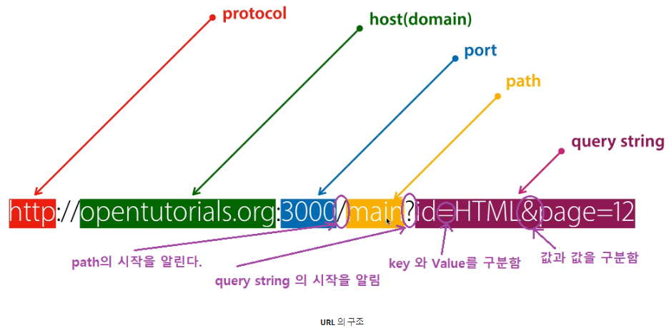

# URL 의 구조

  

## protocal

웹 브라우저와 웹 서버간의 통신 규약. 이것이 FTP 라면 FTP::// 라고 표시될 것

## host(domain)

IP에 이름을 부여한 것 ex) opentutorials.org -> 115.68.24.88

## port

한 컴퓨터에 여러개의 서버 프로그램이 동작할 수 있다. 어느 서버 프로그램과 통신할 것인지 지정해주는  
일종의 출입구  
예를들어 항만(IP)에 여러개의 항구(Port)가 존재한다. 전자제품을 거래하기 위한 항구, 가구를 거래하기 위한 항구, 무기를 거래하기 위한 항구. 이렇게 각 항구별로 목적이 다르고 항만에 들어오는 배들은 자신의 목적에 따라 목적에 맞는 항구(port)에 정박하여야 한다.

## path

서버로 사용되는 컴퓨터의 어떤 디렉토리, 어떤 파일인지를 나태낸다.

## query string

웹 서버로 원하는 데이터를 전송할 때 쓰임.