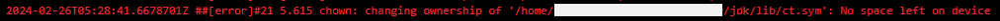
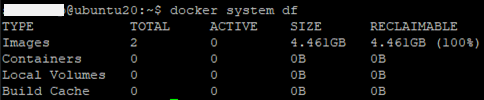

import { Callout } from "nextra/components";

# 도커 빌드 캐시가 계속 증가할 때 어떻게 해결하나 (with. no space left on device error)

어느날 갑자기 CI 과정에서 발생한 에러입니다



Docker Image 를 생성중인 Build server 에서 발생하였고

확인해보니 `Dokcer build cache` 가 저장공간의 대부분을 차지여 남은 저장공간이 없는 상황입니다.

## docker build cache?

`docker build` 를 실행중에, 동일한 이미지 레이어가 있으면 빌드하지 않고 재사용하기위한 목적입니다.

장점은 아래와 같습니다.

- `빠른 빌드`
- 이미지 레이어 `저장공간 최소화`

<Callout type="info" emoji="ℹ">
  **`docker image 레이어`** docker 이미지를 만들기위한 `데이터 블럭` 단위이며,
  여러개의 레이어들을 합쳐서 하나의 Docker Image가 된다. (**포토샵의 레이어와
  비슷함**)
</Callout>

## Build cache는 어떨때 쌓이나?

`dockerfile` 을 빌드했을 때 기존에 존재하던 레이어가 아닌 변경 된 레이어가 있을 경우 생성됩니다.
레이어의 생성 기준은 `dockerfile` 의 명령어와 밀접한 관계가 있습니다.

아래는 이에 대한 예시입니다.

```dockerfile filename="초기 dockerfile"
FROM ubuntu 18.0.4
RUN echo "A"
RUN echo "B"
RUN echo "C"
```

위 도커파일로 빌드했을 때 아래와 같은 이미지 레이어가 생성된다고 가정합니다

| Image Layer | parent |
| ----------- | ------ |
| ubuntu      |        |
| A           | ubuntu |
| B           | A      |
| C           | B      |

그 다음 아래와 같이 dockerfile 을 수정해보겠습니다.

```dockerfile filename="변경 된 dockerfile"
FROM ubuntu 18.0.4
RUN echo "D" // 변경
RUN echo "B"
RUN echo "C"
```

`RUN echo "A" -> RUN echo "D"` 로 변경이 발생하였습니다.

이 변경 된 dockerfile을 빌드하면 몇개의 `새로운 이미지 레이어가`가 생성됩니다.

| Image Layer | parent   |
| ----------- | -------- |
| ubuntu      |          |
| `D`         | `ubuntu` |
| `B`         | `D`      |
| C           | B        |

실제로 값이 바뀐건 `D` 이지만, `B` 의 부모가 `A -> D` 로 바뀐거기 때문에 `B` 의 layer도 새로 생성됩니다.
이때 `특이점`이 존재하는데 변경점이 전혀 없는 B의 자식 레이어인 `C 레이어도 새로 생성`됩니다.

| Image Layer | parent   |
| ----------- | -------- |
| ubuntu      |          |
| `D`         | `ubuntu` |
| `B`         | `D`      |
| `C`         | `B`      |

그 이유는 `도커 이미지 체인`이라는 `부모 레이어가 바뀌면 하위 자식들은 모두 새로 생성된다` 라는 도커의 레이어 관리 방식(?)으로 인해서 발생합니다.

## 도커 이미지 체인으로 인한 주의점

부모 레이어가 바뀌면 하위 자식들은 모두 새로 생성된다 라는 `특이점`으로 인하여 `변경이 자주 발생하는 명령의 경우 Dockerfile의 하단부에 위치` 해야하는 주의점이 존재합니다.

```dockerfile filename="dockerfile"
FROM ubuntu 18.0.4
RUN echo "D" // 지속적인 변경이 예상되면 가장 하단으로 이동해야함
RUN echo "B"
RUN echo "C"
```

그럼 이제 개념을 알아봤으니 실제로 해결을 해보겠습니다.

## 현재 Build cache 용량 확인하기

우선 현재 `Build cache`가 많은 용량을 차지고있는지 확인하는 방법입니다.

```bash
docker system df
```



## 오래되고, 자주 안쓰는 Build cache 지우는 prune 명령어

직접 overlay2 경로에서 지우고싶지만, 어떤 레이어가 쓰이고 안쓰이는 레이언지 구분이 안됩니다.

이를 위해서 docker 에서는 오래되고 자주 안쓰는 Build cache 를 삭제하는 명령을 지원하는데

`prune` 라는 키워드로 `가지치다` 라는 뜻을 지니고 있습니다.

```bash
docker builder prune -a
```

| 옵션             | 설명                                                                                                                                                                           |
| ---------------- | ------------------------------------------------------------------------------------------------------------------------------------------------------------------------------ |
| `-a`, `--all`    | 모든 미사용 빌드 캐시를 제거합니다. 기본적으로, 빌드 캐시 중 일부는 보존됩니다.                                                                                                |
| `--filter`       | 제거할 항목을 선별하는 필터를 설정합니다. 필터는 `key=value` 형식으로 지정됩니다. 여러 필터를 지정할 수 있으며, 이 경우 공백으로 구분됩니다.                                   |
| `-f`, `--force`  | 확인 없이 바로 캐시를 제거합니다. 기본적으로, 사용자에게 캐시를 제거할 것인지 확인을 요청합니다.                                                                               |
| `--keep-storage` | 제거 작업 후에 보존할 총 캐시 공간의 최대 크기를 설정합니다. 예를 들어, `100MB`와 같이 지정할 수 있습니다. 이 옵션을 사용하면 지정된 공간을 초과하는 미사용 캐시가 제거됩니다. |

<Callout type="info" emoji="ℹ">
  "prune"이라는 단어는 라틴어의 "prunum"에서 유래했으며, 이는 '자두'를
  의미합니다. 이 단어가 영어로 어떻게 가지치기와 관련된 의미로 발전했는지는
  흥미롭습니다. 라틴어에서 시작된 "prunum"은 중세 라틴어로 넘어오면서
  "prunare"로 변형되었고, 이는 '자두나무 가지치기'라는 의미를 가지게 되었습니다.
  이는 자두나무를 가지치기하는 것이 자두의 품질을 향상시키는 데 중요한
  관행이었기 때문입니다.
</Callout>
