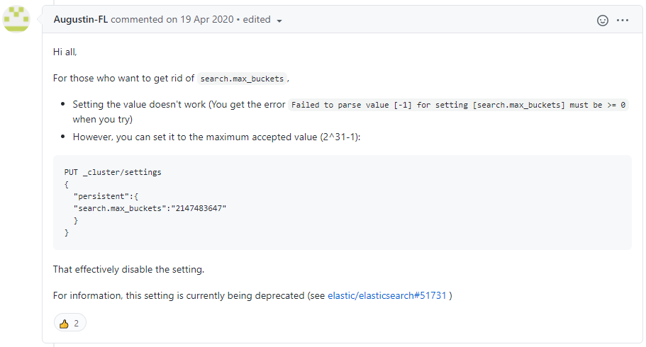

# Elasticsearch too_many_buckets_exception 문제

환경 : Elasticsearch 7.8.1

TermsAggregationBuilder 이용하여 Terms 집계를 사용할 경우  
대량의 데이터를 집계하다가 too_many_buckets_exception 을 마주하게 되었습니다.

```json
{
  "error": {
    "root_cause": [
      {
        "type": "too_many_buckets_exception",
        "reason": "Trying to create too many buckets. Must be less than or equal to: [10000] but was [10001]. This limit can be set by changing the [search.max_buckets] cluster level setting.",
        "max_buckets": 10000
      }
    ]
  }
}
```

해당 익셉션을 키워드로 구글링을 해보니 Bucket 집계를 사용하게되면 집계 결과를 메모리에 저장하게되어 search.max_buckets 를 제한하지 않는다면 과도하게 메모리가 사용될 수 있기에 6.X 이하 버전에서는 search.max_buckets 보다 큰 bucket이 생성되면 경고 메세지를, 7.X 이상 버전에서는 에러를 띄운다는 내용을 찾았습니다.

문제는 search.max_buckets 수를 상수로 제한하여야하는대 필자의 경우 유저들의 로그인 기록을 각 유저마다 통계를 내기 위하여 'userId'라는 field를 기준으로 집계를하는데 이 userId 신규 가입이 이루어질 때마다 증가하는 불특정 값이기에 최대치를 제한할 수 없는 경우입니다.

집계를 비즈니스 로직으로 하자니 집계 속도가 너무나 느리기에 어쩔 수 없이 Terms 집계는 유지해야하기에 6.X 이하 버전때 처럼 경고만 띄우고 에러는 발생하지 않게 하는 방법을 찾던 중 


위 사진에서는 REST API를 통하여 설정을 변경하였지만 저는 config 폴더의 elasticsearch.yml을 직접 수정하여 search.max_buckets: 2147483647 이라는 내용을 추가하였습니다.

  

## 2021-08-27 내용 추가


search.max_buckets 를 수동을 늘리고 사용 시 많은 캐싱을 발생시키는 쿼리 사용시 엘라스틱 서치의 속도가 현저히 느려지거나 OOM 이 발생할 경우가 있습니다.

### 현실적인 해결책으로는

1.  Elasticsearch Heap Memory 증량  
    search.max_buckets 옵션으로 범위를 증가시키고, 사용중에 OOM이 발생할 경우 Elasticsaerch Heap Memory 를 증가시킵니다, 서버의 메모리 증가가 어려운 환경에서는 채택이 불가합니다.

2.  클러스터에 노드(서버) 추가  
    3대 이상의 서버를 클러스터링하여 사용하며, OOM 발생할 경우 추가적으로 서버를 증설하여 메모리 부하를 분산합니다, 서버 증설이 어려운 환경에서는 채택이 불가합니다.

3.  쿼리 수정  
    이중,삼중 Sub 집계 쿼리 또는 필드 조건을 많이주는 정렬 쿼리 또는 큰 범위의 from/size 를 사용하지 않도록 로직을 수정합니다.