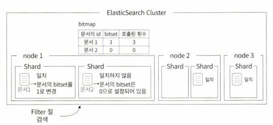

import { Callout } from "nextra/components";

# elasticsearch 에서 사용하는 캐시들을 알아보자 (2024-04-17 기준 미완성, 현재 작성중)

[공홈에서 설명하는 캐시](https://www.elastic.co/kr/blog/elasticsearch-caching-deep-dive-boosting-query-speed-one-cache-at-a-time)

## 페이지 캐시 (Page Cache)

간단하게 [리눅스의 파일 시스템 캐시 방식](https://mainmethod0126.github.io/linux/linux-page-cache) 이라고 보면 된다

### 엘라스틱서치 세그먼트 불변성과 페이지 캐시의 관계

엘라스틱서치에서는 저장되는 데이터들을 [세그먼트](https://mainmethod0126.github.io/elasticsearch/Basic-Concepts-of-Elasticsearch#%EC%84%B8%EA%B7%B8%EB%A8%BC%ED%8A%B8%EB%9E%80)라는 `파일`로 관리한다.

이 **세그먼트의 아주 중요한 특성**이 있는데 바로 [불변하다](https://mainmethod0126.github.io/elasticsearch/Basic-Concepts-of-Elasticsearch#%EC%84%B8%EA%B7%B8%EB%A8%BC%ED%8A%B8%EB%8A%94-%EB%B6%88%EB%B3%80immutable%ED%95%98%EB%8B%A4)는 것이다

이말은 즉슨, **한번 페이지 캐시된 세그먼트 파일의 경우 세그먼트 파일이 삭제되어서 영원히 안쓰게 되는 경우를 제외하고는 dirty(변경됨) 체크될 일이 없다**

**페이지 캐시의 데이터 변경으로 인하여 디스크 I/O가 발생할 일이 극히 드물다는 뜻이다.**

그렇기 때문에 **거의 대부분의 경우 캐시에서 데이터를 불러오기 때문에 속도가 상당히 빠르다**

위와 같은 이유로, **엘라스틱서치의 세그먼트 불변성은 페이지 캐시와 아주 찰떡이다**

<Callout type="warning" emoji="❔">
"세그먼트 병합은 삭제가 아니니까 dirty 체크 되는거 아니니?"

사실상 병합도 삭제다.

A, B의 데이터가 하나로 압축되어 AB 라는 새로운 세그먼트 파일이 생성되고 A, B 단일 세그먼트 파일들은 삭제된다
그러니 세그먼트 파일은 `생성`, `삭제` 두 케이스만 존재하는거라고 봐야한다.

</Callout>

### 유의 사항 : 최대 메모리의 반은 남겨놔야한다

운영체제가 관리하기 때문에 커널 메모리 영역을 사용하게된다

그렇기 때문에 elasticsearch 실행 시 [최대 메모리의 반은 남겨놓고 나머지 반에서 heap을 할당하는 것으로 권장](https://www.elastic.co/guide/en/elasticsearch/reference/7.11/tune-for-search-speed.html#_give_memory_to_the_filesystem_cache_2)한다.

**나머지 반은 페이지 캐시를 위한 커널 메모리 영역**으로 남겨놔야하기 때문이다.

만약 이를 무시하고 대부분의 메모리를 elasticsearch heap으로 할당하게되면 페이지 캐시 성능이 저하될 것이다

<Callout type="info" emoji="❕">
캐시 공간은 한정적이기 때문에 잘 관리해줘야하는데, 리눅스에서는 이를 위하여 [LRU 페이키 교체 매커니즘](https://ko.wikipedia.org/wiki/Least_Recently_Used)을 사용한다
간단하게 설명하면 **"가장 오랫동안 참조되지 않은 페이지 영역을 내리고 다른 페이지로 교체한다"**

</Callout>

---

## 샤드 요청 캐시 (Shard Request Cache)

**검색 결과를 반환하지 않는 검색 요청에 대한 캐시**

쉽게 말해 **document 자체를 반환하지 않는 요청** 에 대한 캐시이다

특징으로는

- **총 힙의 1% 를 차지한다**
- **기본적으로 활성화된다**
- **요청 매개변수를 통해 document를 반환하는 경우에도 캐시를 사용하도록 할 수 있다**
- **요청에 대한 전체 응답을 캐시한다**
- `GET /_nodes/stats/indices/request_cache?human` 쿼리로 모니터링 가능하다

### 캐시 Hit 조건

샤드에 요청이 왔을 때 동일한 요청(쿼리)일 경우 hit된다

예를들어 쿼리의 결과가 `인덱스A,B,C,D,E` 를 전부 포함하는 `A~E`라는 이름의 쿼리를 요청을 하고나서
그 다음으로 `인덱스B,C,D,E,F` 를 전부 포함하는 `B~F`라는 이름의 쿼리를 요청하면

첫번째 요청되었던 쿼리와 두번째 쿼리는 `인덱스 B,C,D,E` 라는 부분이 `완전 동일`하다.

즉 `인덱스 B,C,D,E` 를 전부 포함하는 `B~E` 라는 쿼리를 `두번 요청한 것과 동일`하다

그러므로 캐시가 **hit**된다

물론 `인덱스A,B,C,D,E`를 두번 요청하거나,

`인덱스B,C,D,E,F`를 두번 요청할 경우에도 당연히 캐시가 hit된다

캐시가 얼만큼 히트되고있는지 쿼리를 통해 확인 가능하다

```http filename="캐시 사용에 대한 통계 쿼리"
GET /_nodes/stats/indices/request_cache?human
```

이제 **document 자체를 반환하지 않는 요청** 에 대한 예시를 알아보겠다

### 집계 요청

캐시하려면 `size : 0` 으로 `검색 결과를 반환하지 않음` 을 명시해야한다

쇼핑몰에서 **`상품 카테고리 별 판매 량`** (예시 : `전자기기 : 100`, `책 : 3000`, `스포츠 용품 : 500`) 을 집계한다는 예시를 들어보겠다

```json filename="상품 카테고리 별 판매량 집계 쿼리"
GET /products/_search
{
  "size": 0,  // 검색 결과를 반환하지 않음
  "aggs": {
    "sales_per_category": {
      "terms": {
        "field": "category.keyword",
        "size": 10
      }
    }
  }
}
```

```json filename="쿼리 결과"
{
  "took": 30,
  "timed_out": false,
  "_shards": {
    "total": 5,
    "successful": 5,
    "skipped": 0,
    "failed": 0
  },
  "hits": {
    "total": {
      "value": 10000,
      "relation": "gte"
    },
    "max_score": null,
    "hits": []
  },
  "aggregations": {
    "sales_per_category": {
      "doc_count_error_upper_bound": 0,
      "sum_other_doc_count": 100,
      "buckets": [
        {
          "key": "electronics",
          "doc_count": 1500
        },
        {
          "key": "clothing",
          "doc_count": 1200
        },
        {
          "key": "home appliances",
          "doc_count": 800
        },
        {
          "key": "books",
          "doc_count": 400
        },
        {
          "key": "sports",
          "doc_count": 300
        }
        // 추가 카테고리 데이터는 생략
      ]
    }
  }
}
```

위와 같은 예시의 쿼리를 요청했을 때 검색된 **document 가 반환된 것이 아닌 집계 결과만 반환**되었다
이럴때 쿼리 결과가 캐시된다

### 카운트 요청

카운트 요청 역시 **document를 반환하지 않는다**

**지난 한 달 동안 특정 이벤트가 발생한 로그의 수**를 확인하는 요청을 예시로 들어보겠다

```json filename="지난 한 달 동안 특정 이벤트가 발생한 로그 카운트 쿼리"
GET /logs/_count
{
  "query": {
    "bool": {
      "filter": [
        {"term": {"event": "login"}},
        {"range": {"timestamp": {"gte": "now-1M/M", "lte": "now/M"}}}
      ]
    }
  }
}
```

```json filename="쿼리 결과"
{
  "count": 2520,
  "_shards": {
    "total": 5,
    "successful": 5,
    "skipped": 0,
    "failed": 0
  }
}
```

위와 같이 결과에는 `document 가 포함되어 있지 않다`
마찬가지로 캐시된다

### kibana 시각화

필자는 kibana를 써보지 않아 모르기 때문에 링크로 대체한다 [공홈에서 설명하는 캐시](https://www.elastic.co/kr/blog/elasticsearch-caching-deep-dive-boosting-query-speed-one-cache-at-a-time)

---

## 노드 쿼리 캐시 (Node Query Cache)

`filter Context` 를 이용한 검색 결과가 `노드에 캐시`된다

- **`filter` 조건으로 검색해야 캐싱된다.**
- **노드안에서 발생하는 모든 쿼리간에 공유된다**
- **노드에 캐시된다**
- **기본으로 heap 공간의 최대 10%를 사용한다**
- **`GET /_nodes/stats/indices/query_cache?human` 쿼리로 모니터링 가능하다**
- **`indices.queries.cache.count` 옵션으로 총 캐시 수량을 제한할 수 있다 기본값 : 10,000 개**
- **`indices.queries.cache.size` 옵션으로 Java 힙 몇퍼센트를 사용할지 제한할 수 있다 기본값 : 10%**
- **`bitset` 을 이용하여 캐시를 관리하다**

### 캐시 Hit 조건

동일한 `filter query` 에 한해서 hit 된다

예시를 통해서 알아보자

```json filename="filter 쿼리 예시"
GET logs-*/_search
{
  "query": {
    "bool": {
      "must": [
        {
          "match": {
            "message": "pcre2_get_error_message"
          }
        }
      ],
      "filter": [
        {
          "range": {
            "@timestamp": {
              "gte": "2021-02-01",
              "lt": "2021-03-01"
            }
          }
        }
      ]
    }
  }
}
```

위 쿼리가 한번 실행되고나서 그 다음 쿼리들이

```json filename="filter query"
        //~~
      "filter": [
        {
          "range": {
            "@timestamp": {
              "gte": "2021-02-01",
              "lt": "2021-03-01"
            }
          }
        }
      ]
      //~~
```

`filter query` 영역만 유지하고 다른 곳은 바꿔서 쿼리해도 동일한 `filter query`에 한해서는 `쿼리간에 캐시가 공유된다`

만약에 `"gte": "2021-02-01"` 값을 `"gte": "2021-02-20"`, 과 같이 변경했다면, **캐시 데이터를 사용하지 않고 새로운 캐싱을 하게된다**

### 내부 로직



위 이미지와 같이 `filter 쿼리`가 발생하면 내부적으로 해당 `filter 쿼리`에 고유한 `bitmap` 을 생성하고, **한번 조회된 document에 비트마킹(bitset)**을 해놓는다
그러면 다음번에 동일한 `filter 쿼리`가 발생했을 때 `bitmap에서 마킹된 document`를 반환한다

## 필드 데이터 캐시 (Field Data Cache)

`집계, 정렬 시 필드 데이터를 전부 캐싱한다`

검색은 `"어떤 문서가 이 키워드를 포함하는지가 궁금"` 하지만
집계와 정렬은 `"이 문서에서 이 field의 값이 무엇인지"` 가 궁금하기 때문에
역인덱스 정보가 아닌 docmuent를 key로 value에 field 정보를 담은 데이터 구조가 필요하다.

즉 역인덱스가 아닌 일반적인 인덱스(RDB의 그것) 방식이 필요하다 이를 `fielddata` 라고 한다.

특이점으로는 `text field`를 캐싱하게되면 상당히 많은 메모리를 사용하기 때문에 `text field`는 기본적으로 비활성이다.

- **집계 쿼리 및 정렬에 사용되는 필드 데이터를 모두 캐시한다**
- **Text Field의 기본값은 false다**
- **일단 메모리에 올리고나서 메모리가 부족할 경우 공간을 확보하기 때문에 OOM 이 발생할 수 있다**
- **캐시중 가장 많은 메모리를 소모한다**
