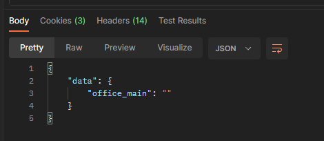

# 출근 체크 자동화를 위한 하이웍스 로그인 및 출근 분석

## 로그인 API 분석

확인해보니 rest api 규격이고 로그인 request는 아래와 같다

### request

- url : https://auth-api.office.hiworks.com/office-web/login
- method : post
- header : `Content-Type: "application/json"`
- body
```json
{
  "id": "아이디",
  "password": "패스워드",
  "ip_security_level": "1" // 이름만 봐서는 로그인용 ip를 제한 시키는 용도 같음 (회사 ip대역 또는 할당받은 고유ip에서만 로그인 가능하도록 하는 경우에 사용할 듯?)
}
```

### response

회사 정보와 세션을 쿠키에 담아서 response 하는 것으로 보인다.
이 쿠키들을 api 요청할때 사용하면 될 것으로 보인다

#### body

```json
{
  "data": {
    "office_main": ""
  }
}
```



#### cookies

  

#### headers

  


## Submit 핸들 (onSubmit Function)
  

## 찾았다! 출근 체크 로직

  

## G 객체 - create()

  

그럼 this.url/ + `"web/time-record"` 라는 말인데, url 값이 뭔지 확인만 할 수 있으면 끝난 것 같다.

## G 객체 - this.url

  

찾았다 내 사랑

## "출근" API 호출해보기

### request

- url : https://hr-timecheck-api.office.hiworks.com/v4/web/time-record
- method : post
- header : `Content-Type: "application/json"`
- body
```json
{
    "data" : {
        "type": "1"
    }
}
```

### response

성공하면 response body 는 `빈값`이오고
http status code 는 `201` 이 찍힙니다

만약 한번 출근 후 출근을 재시도하면 아래와 같은 오류가 발생합니다.

```json
{
    "errors": {
        "status": 400,
        "title": "Bad Request",
        "message": "해당 근무체크를 할 수 없습니다."
    }
}
```


