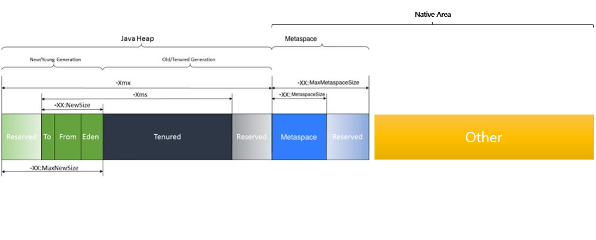

# java 프로세스 메모리가 계속 증가한다..! 메모리 누수일까?

CentOS7에 java 프로세스를 가동시키고 해당 java service가 제공하는 api를 계속 호출했더니 메모리가 야금야금 증가해서 증가한 메모리를 유지하는 현상을 발견했습니다
과연 이게 메모리 누수인지 아니면 다른 이유인지 확인해 보겠습니다.

# Java Service 실행 환경

```bash
api version : 2.3.1
os : CentOS Linux release 7.7.1908 (Core)
jdk : openjdk "14.0.1"
java options : -server -Xms2g -Xmx2g -Xss256k -XX:MetaspaceSize=256m -XX:MaxMetaspaceSize=256m -Dfile.encoding=UTF-8
```

## Java options 설명

1. **server** : 해당 옵션은 최고 작동 속도를 최대화하도록 특별히 조정되었습니다. 빠른 시작 시간 또는 더 작은 런타임 메모리 풋 프린트보다 가능한 가장 빠른 작동 속도가 필요한 장기 실행 서버 애플리케이션을 실행하기위한 것입니다.
   **64bit JDK 는 암시적으로 무조건 server 옵션이 적용됩니다.**
   

2. **Xms** : 설정은 Java 힙의 초기 크기를 제어합니다. 이 매개변수를 적절하게 조정하면 가비지 콜렉션의 오버헤드를 줄여서 서버 응답 시간 및 처리량을 개선합니다. 일부 응용프로그램의 경우, 이 옵션에 대한 기본 설정이 너무 낮아서 사소한 가비지 콜렉션의 수가 높아질 수 있습니다.
   


3. **Xmx** : Java 힙의 최대 크기를 제어합니다. 이 매개변수를 늘리면 Application Server에 사용 가능한 메모리가 늘어나고 가비지 콜렉션 빈도가 줄어듭니다. 이 설정을 늘리면 서버 응답 시간 및 처리량이 개선될 수 있습니다. 그러나 이 설정을 늘리면 가비지 콜렉션이 발생할 때 해당 콜렉션의 지속 기간이 늘어납니다. 이 설정은 Application Server 인스턴스에 대해 사용 가능한 시스템 메모리 이상으로 증가해서는 안됩니다. 설정을 사용 가능한 시스템 메모리 이상으로 늘리면 시스템 페이징 및 상당한 성능 감소를 유발할 수 있습니다.
   


4. **Xss** : 스레드 스택 크기(바이트)를 설정합니다
   


5. **-XX:MetaspaceSize** : 가비지 컬렉션을 처음 초과할 때 트리거할 할당된 클래스 메타데이터 공간의 크기를 설정합니다. 가비지 수집에 대한 이 임계값은 사용된 메타데이터 양에 따라 증가하거나 감소합니다. 기본 크기는 플랫폼에 따라 다릅니다.
   


6. **-XX:MaxMetaspaceSize** : 클래스 메타데이터에 할당할 수 있는 최대 네이티브 메모리 양을 설정합니다. 기본적으로 크기는 제한되지 않습니다. 응용 프로그램의 메타데이터 양은 응용 프로그램 자체, 실행 중인 다른 응용 프로그램 및 시스템에서 사용할 수 있는 메모리 양에 따라 달라집니다.

oracle options doc : https://docs.oracle.com/javase/8/docs/technotes/tools/windows/java.html


---

# 분석


## 코딩 실수로인한 메모리 누수(Memory leak) 여부

코딩상의 실수로 메모리가 누수가 발생하였는지 판단합니다.

### 1. Eclipse Memory Analyzer를 이용한 Heap Dump 분석

**2.4gb** 로 동작중이던 Java process의 memory가 **2.6gb**로 증가되고 유지되었습니다.
증가량은 약 **0.2gb**입니다.

메모리 누수 여부를 확인하기 위하여 **jmap**으로 증가한 API Service의 **Heap Dump**를 가져와 **Eclipse Memory Analyzer** 로 분석합니다.

#### jmap 을 이용한 heap dump 생성 방법

```bash
./jmap -dump:format=b,file=<파일명> <PID>
```

#### 분석 결과


해당 service의 dump를 확인 결과 현재 사용중인 heap memory 영역은 **43.3mb**이며 메모리 증가로 가정되었던 **0.2gb**에 현저히 미치지 못하는 사용률을 보입니다.

---


### 2. Jconsole 을 이용한 실시간 Heap Memory 모니터링

위 Dump를 근거로 실제 Heap Memory사용이 비슷하게 이루어지나 실시간 모니터링을 실시합니다.

#### Jconsole 사용 방법

1. 감시하고싶은 java process를 시작할때 아래와 같은 **java options** 을 추가한다.

```
-Dcom.sun.management.jmxremote=true
-Dcom.sun.management.jmxremote.port=임의의 PORT
-Dcom.sun.management.jmxremote.ssl=false
-Dcom.sun.management.jmxremote.authenticate=false
-Djava.rmi.server.hostname=서비스할 PC IP
```

2. 모니터링을 진행할 PC에서 Jconsole을 실행합니다.
3. 실행 된 Jconsole에서 Remote Process에 위에서 지정한 **-Djava.rmi.server.hostname**의 값을 넣어 연결합니다.

#### 분석 결과


위 이미지를 통하여 **Heap memory**는 java prcess를 실행할때 지정했던 option **Xmx2g** 를 상회하지 않고 **할당**과 **해제**가 뚜렷하게 보이며 위 그래프를 통해 **Heap memory** 즉 개발자가 **임의적으로 할당하는 메모리 영역**에 대한 누수는 확인되지 않았습니다.


#### 메모리 누수가 발생하는 Java Process의 예시


---

# 결론

## 그렇다면 메모리 누수가 아닌대 오르고있는 메모리는 무엇인가?

메모리 누수가 아니다, 그렇다면 실제로 오르고있는 저 메모리는 무엇일까요?
java 프로세스의 메모리 영역은 크게 **Heap Memory** 와 **Native Memory** 영역이 있습니다.


위 그림과 같이 영역 구분이 가능하며 이중에서 사용자가 크기를 설정할 수 있는 부분은 **Java Heap**과 **Metaspace** 영역입니다.
그 외 영역은 JVM과 OS가 사용하는 영역이며 최대 사용량에 대한 예측은 **JVM native memory tracking** 으로 JVM이 임시로 잡아두는 영역인 **reserved(임시 메모리)** 값을 통하여 확인가능합니다.

### JVM의 reserved 와 committed 의 예


메모리 누수처럼 보이던 java service의 메모리 사용량이 증가하는 것은 JVM이 사용하는 **Native Memory**의 **committed(실제 사용중인 메모리)** 가 **reserved(임시 메모리)** 크기 안에서 증가하는 것이며, 최대 **reserved(임시 메모리)** 크기를 벗어나지 않을 것 입니다.

---


# 기타 설명

## Heap Memory

힙 영역은 모든 자바 클래스의 인스턴스(instance)와 배열(array)이 할당되는 곳으로, 런타임(run time) 데이터를 저장하는 영역이다. 힙 영역은 JVM이 시작될 때 생성되어 애플리케이션이 실행되는 동안 크기가 커졌다 작아졌다 한다. 힙 영역의 크기는 -Xms VM option으로 지정된다고 한다. 힙 영역의 크기는 가비지 컬렉션의 전략에 따라 고정된 크기일수도 있고, 유동적으로 변경될 수도 있다.
oracle heap-memory doc : https://docs.oracle.com/cd/E13150_01/jrockit_jvm/jrockit/geninfo/diagnos/garbage_collect.html

## Native Memory

JVM은 클래스 메타데이터, 애플리케이션 코드, JIT에 의해 생성된 코드, 내부 데이터 구조 등을 유지하기 위해 네이티브 메모리에서 상당히 큰 청크를 할당합니다
JVM이 Native Memory 영역에 사용하는 항목들은 아래와 같습니다.

- Metaspace
- Threads
- Code Cache
- Garbage Collection
- Symbols
- Native Byte Buffers
- Additional Tuning Flags

jvm native-memory doc : https://www.baeldung.com/native-memory-tracking-in-jvm

## JVM native memory tracking 방법

1. java 실행인자에 -XX:NativeMemoryTracking=detail
2. 터미널 명령어 `<jdk설치위치>`/bin/jcmd `<pid>` VM.native_memory detail 실행
3. 결과

```
5746:

Native Memory Tracking:


Total: reserved=2914585KB, committed=2390505KB
-                 Java Heap (reserved=2097152KB, committed=2097152KB)
                            (mmap: reserved=2097152KB, committed=2097152KB)

-                     Class (reserved=315585KB, committed=68929KB)
                            (classes #12549)
                            (  instance classes #11710, array classes #839)
                            (malloc=2241KB #37324)
                            (mmap: reserved=313344KB, committed=66688KB)
                            (  Metadata:   )
                            (    reserved=59392KB, committed=58624KB)
                            (    used=57333KB)
                            (    free=1291KB)
                            (    waste=0KB =0.00%)
                            (  Class space:)
                            (    reserved=253952KB, committed=8064KB)
                            (    used=7290KB)
                            (    free=774KB)
                            (    waste=0KB =0.00%)

-                    Thread (reserved=85475KB, committed=31611KB)
                            (thread #294)
                            (stack: reserved=84088KB, committed=30224KB)
                            (malloc=1045KB #1766)
                            (arena=343KB #586)

-                      Code (reserved=249522KB, committed=25962KB)
                            (malloc=1834KB #9033)
                            (mmap: reserved=247688KB, committed=24128KB)

-                        GC (reserved=122444KB, committed=122444KB)
                            (malloc=11576KB #25778)
                            (mmap: reserved=110868KB, committed=110868KB)

-                  Compiler (reserved=513KB, committed=513KB)
                            (malloc=348KB #916)
                            (arena=165KB #5)

-                  Internal (reserved=4879KB, committed=4879KB)
                            (malloc=4843KB #4118)
                            (mmap: reserved=36KB, committed=36KB)

-                     Other (reserved=4735KB, committed=4735KB)
                            (malloc=4735KB #53)

-                    Symbol (reserved=11979KB, committed=11979KB)
                            (malloc=10756KB #310319)
                            (arena=1223KB #1)

-    Native Memory Tracking (reserved=6634KB, committed=6634KB)
                            (malloc=353KB #4976)
                            (tracking overhead=6282KB)

-        Shared class space (reserved=11324KB, committed=11324KB)
                            (mmap: reserved=11324KB, committed=11324KB)

-               Arena Chunk (reserved=3384KB, committed=3384KB)
                            (malloc=3384KB)

-                   Logging (reserved=5KB, committed=5KB)
                            (malloc=5KB #198)

-                 Arguments (reserved=14KB, committed=14KB)
                            (malloc=14KB #454)

-                    Module (reserved=508KB, committed=508KB)
                            (malloc=508KB #3665)

-                 Safepoint (reserved=8KB, committed=8KB)
                            (mmap: reserved=8KB, committed=8KB)

-           Synchronization (reserved=423KB, committed=423KB)
                            (malloc=423KB #2695)
```
