import { Callout } from 'nextra/components'

# java open source 라이브러리 프로젝트를 maven central 에 배포하기 (with gradle)

## jira 티켓 등록

무료로 [Open Source Project Repository Hosting(OSSRH)](https://issues.sonatype.org/) 을 지원해주는 Jira 에서 티켓을 등록합니다. 

먼저 로그인을 진행한 후 `만들기` 버튼을 찾아서 **신규 이슈를 생성합니다**

## 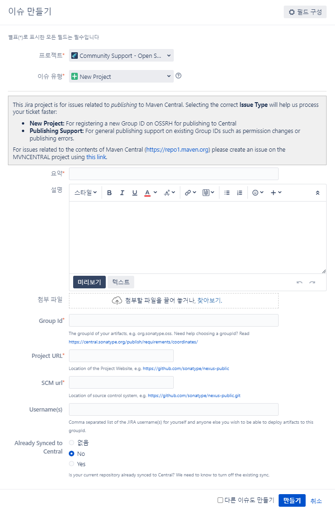  

예시
```text
- 프로젝트 : Community Support - Open Source Project Repository Hosting (OSSRH)
- 이슈 유형 : New Project
- 요약 : annotation-scanner
- 설명 : It's a service that helps find specific annotations used in a project.
- Group Id : io.github.mainmethod0126
- Project URL : https://github.com/mainmethod0126/annotation-scanner
- SCM URL : https://github.com/mainmethod0126/annotation-scanner.git
- Username : Shin Woosub
```


이슈가 생성되면 즉시 **자동 Bot이 Github 계정에 대한 소유권을 증명**하라고 댓글을 달아줍니다.
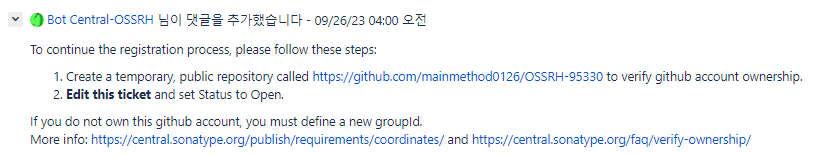  
예시 이미지 상에서는 `OSSRH-95330` 이라는 이름의 **public Repository** 생성해 놓으라고 합니다.

레포를 생성했다면 그 다음 다시 이슈로 돌아와서 상태를 `OPEN` 으로 바꿔놓습니다.

그러면 일정 시간 후 (길게는 하루) 

  

와 같은 댓글이 달리면서 이슈가 **Resolved** 상태로 변경됩니다.

<Callout type="warning" emoji="⚠">
만약 5일동안 소유권 증명을 안하면 그 이후에 레포를 생성한다고 하더라도 자동으로 소유권 확인이 되지 않습니다.
5일이 지나면 사람이 직접 댓글을 달면서 이렇게 저렇게 해라~ 라고 안내해줄텐대 그 방식대로 소유권 증명을 하셔야합니다.
그러니 최대한 5일 안에 진행하시는게 편하십니다.
</Callout>


## build.gradle 수정

gradle 에서 maven Repository 에 배포하기 위해서는 **maven-publish** 라는 플러그인을 사용해야하는데 

[공식 문서](https://docs.gradle.org/current/userguide/publishing_maven.html)가 너무나 잘 정리되어 있어서 더 자세한 내용이 필요하신 분은 공식 문서 참고 부탁드리겠습니다.

배포를 위해서는 아래 항목들이 필수로 추가 되어야합니다.

```groovy filename="build.gradle"
plugins {
    id 'java-library'
    id 'maven-publish'
    id 'signing'
}

group = 'com.example'
version = '1.0'

java {
    withJavadocJar()
    withSourcesJar()
}

publishing {
    publications {
        mavenJava(MavenPublication) {
            artifactId = 'my-library'
            from components.java
            versionMapping {
                usage('java-api') {
                    fromResolutionOf('runtimeClasspath')
                }
                usage('java-runtime') {
                    fromResolutionResult()
                }
            }
            pom {
                name = 'My Library'
                description = 'A concise description of my library'
                url = 'http://www.example.com/library'
                properties = [
                    myProp: "value",
                    "prop.with.dots": "anotherValue"
                ]
                licenses {
                    license {
                        name = 'The Apache License, Version 2.0'
                        url = 'http://www.apache.org/licenses/LICENSE-2.0.txt'
                    }
                }
                developers {
                    developer {
                        id = 'johnd'
                        name = 'John Doe'
                        email = 'john.doe@example.com'
                    }
                }
                scm {
                    connection = 'scm:git:git://example.com/my-library.git'
                    developerConnection = 'scm:git:ssh://example.com/my-library.git'
                    url = 'http://example.com/my-library/'
                }
            }
        }
    }
    repositories {
        maven {
            // change URLs to point to your repos, e.g. http://my.org/repo
            def releasesRepoUrl = layout.buildDirectory.dir('repos/releases')
            def snapshotsRepoUrl = layout.buildDirectory.dir('repos/snapshots')
            url = version.endsWith('SNAPSHOT') ? snapshotsRepoUrl : releasesRepoUrl
        }
    }
}

signing {
    sign publishing.publications.mavenJava
}


javadoc {
    if(JavaVersion.current().isJava9Compatible()) {
        options.addBooleanOption('html5', true)
    }
}
```

### 필수 항목들

**nexus repository**에 업로드 하기 위해서는 library 의 **필수 항목**(sonatype 에서 해주는 기능인 maven repo 업로드를 위한 표준인지는 모르겠습니다)들이 존재하는데 아래와 같습니다.

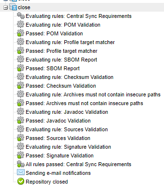  

여기서 하나라도 빠지면 업로드가 불가능하게됩니다.

필수 항목이 빠졌을 경우 업로드 불가 예시
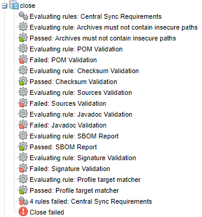  


**javadoc jar, source jar, pom** 등은 위에 말씀드린 build.gradle 의 항목을 열심히 채워주면 문제없이 진행되지만,

별도로 손이 가는 작업이 **서명(sign)** 부분입니다.

저희가 일반적으로 사용하는 윈도우OS에서 서명되지 않은 실행 파일의 경우 경고를 띄우는 것 처럼 서명이 되지 않은 library 는 신뢰성이 떨어지기 때문에 **서명**을 필수로 해야합니다.

서명되지 않은 실행파일 실행에 대한 윈도우OS의 경고 화면
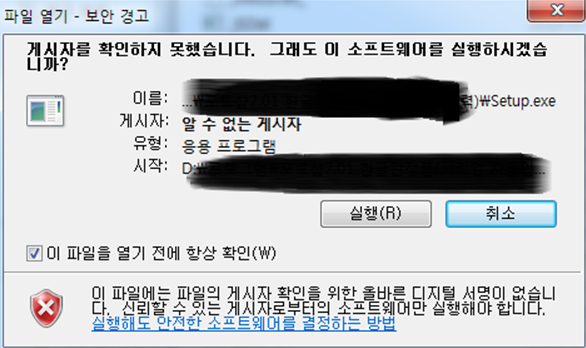  

## 서명(sign) 하기

인터넷에 검색해서 나오는 예시들이 대부분 리눅스라 저는 윈도우os 기준으로 보여드리겠습니다.

만약 리눅스(맥OS) 를 사용하시는 분들은 구글에 검색하면 금방나오기 때문에 참고해주시면 감사하겠습니다.

### gpg4win 다운로드

[gpg4win](https://www.gpg4win.org/) 이라는걸 다운해야합니다.

[링크](https://www.gpg4win.org/)로 이동한 후 아래 화면과 같이 다운로드를 진행합니다

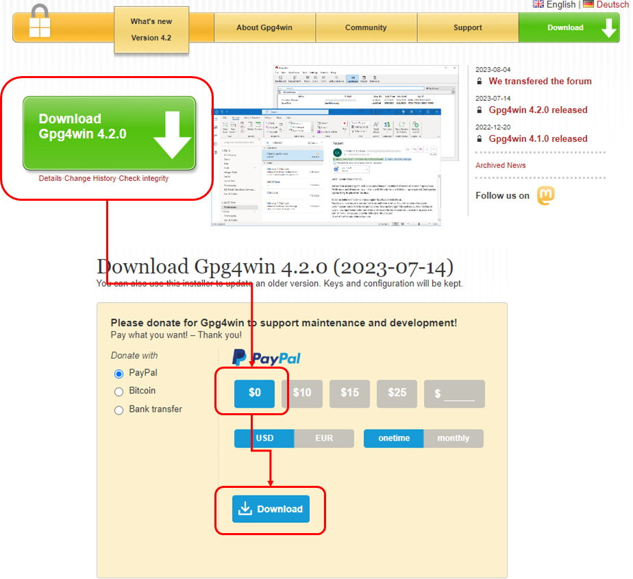  

<Callout type="info" emoji="ℹ️">
    설치 단계에서 "Kleopatra" 를 같이 설치할 거냐고 물어보는데 구글링 대부분은 커멘드 라인이 예시기 때문에 저는 
    "Kleopatra" 를 이용한 GUI 사용법을 안내드릴 거니 설치하셔야 합니다.
</Callout>

### 키 생성

설치 후 "Kleopatra" 를 실행해서 `파일 > 새 OpenPGP 키 쌍 생성` 을 진행합니다

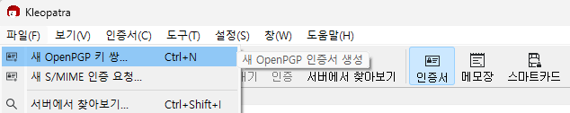  

생성시에는 꼭 `생성한 키를 암구호로 보호합니다.` 를 선택해주셔야하는데 이를 선택하면 생성 시 암호를 입력받게됩니다.

이 암호는 **꼭! 기억하셔야합니다.**

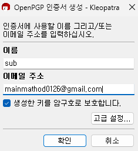  

생성하면 아래와 같이 등록되는데 여기서 **`키 ID 끝 8자리`** 를 기억합니다.

예시 에서는 `360ADE6D` 를 가 되겠습니다

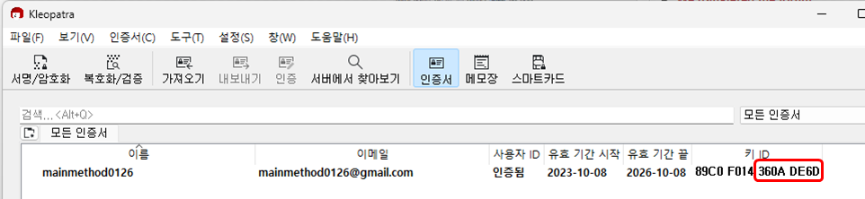  

### 서버에 등록

이제 생성된 키 쌍(개인 키/공개 키) 에서 개인키로 서명된 것이 변조되지 않은 정상적인 서명인지 확인하기 위해서 **공개키** 를 **public 한 서버에 업로드해줘야합니다.**

`생성된 키를 리스트에서 선택 후 > 우클릭 > 서버에 게시` 를 진행합니다.

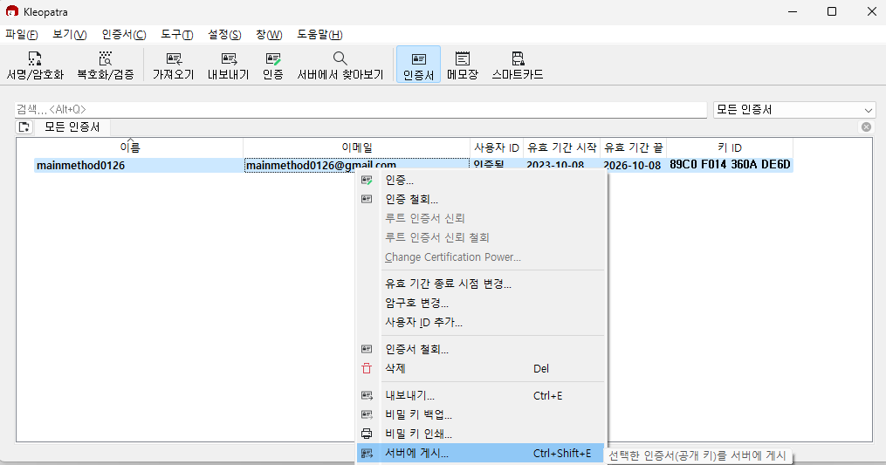  

### gradle signing 플러그인을 이용하여 서명을 하기 위한 key 정보 등록

자 이 다음은 어쩔 수 없이 커맨드 라인을 이용해야합니다

`secring.gpg` 라는 파일을 생성해야하는데, 해당 문서 포맷이 예전 형식이라 그런지 최신 GUI에서는 생성 기능을 제공하지 않습니다.

**관리자 권한으로 명령 프롬프트** 를 실행한 후

`gpg --export-secret-keys <keyId> > secring.gpg` 라는 명령어를 실행할 것인데 `keyId` 값에는 위에서 확인한 **`키 ID 끝 8자리`** 를 입력합니다.

예시
```bash filename="명령 프롬프트"
gpg --export-secret-keys 360ADE6D > secring.gpg
```

생성된 `secring.gpg` 파일은 일반적으로  `%AppData%\Roaming\gnupg` 경로에 생성되는데, 해당 경로에 들어가서 파일이 정상적으로 생성되었는지 확인합니다.


#### signing properties 추가

자 이제 gradle signing 플로그인이 서명을 할 수 있도록 properties 를 추가해야합니다.

여기에 쓰이는 프로퍼티는 아래와 같습니다

```text
signing.keyId=<keyId>
signing.password=<키 생성 시 사용한 패스워드>
signing.secretKeyRingFile=<secring.gpg 절대 경로>
```

해당 properties 들을 **build.gradle** 에서 참조할 수 있도록 해야하는데

library 프로젝트 루트 경로에 **gradle.properties** 라는 파일을 생성하고 위 내용을 그대로 추가합니다. (만약 이미 있을 경우 별도 생성 없이 내용만 추가)


예시
```text filename="gradle.properties"
signing.keyId=360ADE6D
signing.password=1q2w3e4r5t
signing.secretKeyRingFile=C:\\Users\\Sub\\AppData\\Roaming\\gnupg\\secring.gpg
```

### publish 실행

자 이제 실제로 배포를 진행해보겠습니다.

`build.gradle` 에서 이슈를 등록했던 `sonatype jira id, pw` 를 추가하여 인증을 진행해야하는데
아래와 같이 `build.gradle` 를 수정해야합니다.

```groovy filename="build.gradle"
    repositories {
        maven{
            credentials {
                username = <sonatype jira id>
                password = <sonatype jira password>
            }

			url = https://s01.oss.sonatype.org/service/local/staging/deploy/maven2/
        }
    }
```

여기서 id,pw 를 평문 텍스트 파일로 관리하시기 부담되시는 분들은 `parameter` 방식으로 입력하는 방법이 있습니다.

```groovy filename="build.gradle"

publishing {

	String inputUsername = project.findProperty("username") ?: ""
	String inputPassword = project.findProperty("password") ?: ""
    String inputMavenRepoUrl = project.findProperty("url") ?: ""

    //~~~

    repositories {
        maven{
            credentials {
                username = inputUsername
                password = inputPassword
            }

			url = inputMavenRepoUrl
        }
    }
```

```bash
gradlew publish -PinputUsername=wusub -PinputPassword=1q2w3e4r5r -PinputMavenRepoUrl=https://s01.oss.sonatype.org/service/local/staging/deploy/maven2/
```

parameter 를 사용하지 않고 직접 텍스트를 파일에 입력했을 경우 예시
```bash
gradlew publish
```

### publish 결과 확인

[nexus repository manager](https://s01.oss.sonatype.org/#stagingRepositories) 에서 publish 결과를 확인할 수 있는데

`sonatype jira 이슈를 등록한 계정으로 로그인 후 > Staging Repository`

로 이동하여 list에 업로드 되었다면 일단 publish 는 정상적으로 진행된 것이며,

이제 maven central 에 업로드 하기 위한 추가 작업을 진행해야합니다.

list에서 item을 체크한 후 **Close** 를 클릭하면 검증(
**javadoc jar, source jar, pom, sign 등**)을 진행하는데, 정상적으로 완료되면 `Status가 closed`로 변경됩니다.


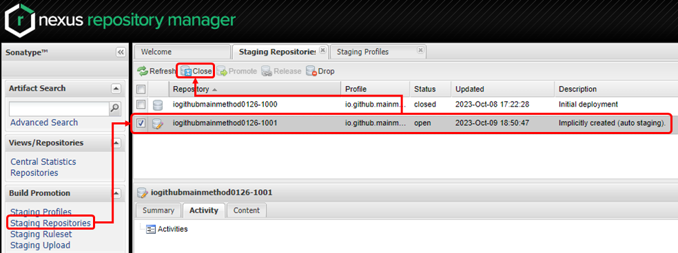  

이후 closed된 item을 선택하고 `Release` 를 클릭하면 일정 시간 뒤 maven central 로 배포가 진행됩니다.

[예시로 사용 된 프로젝트 maven url](https://repo1.maven.org/maven2/io/github/mainmethod0126/annotation-scanner/)

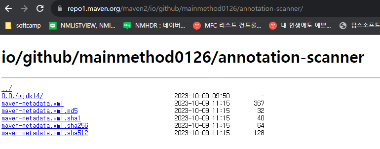  


[실제 프로젝트에 적용된 build.gradle 예시](https://github.com/mainmethod0126/annotation-scanner/blob/main/app/build.gradle)는 여기서 확인하실 수 있습니다.

