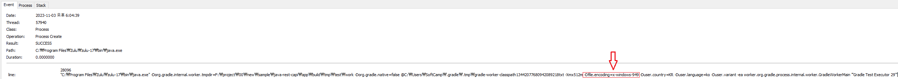
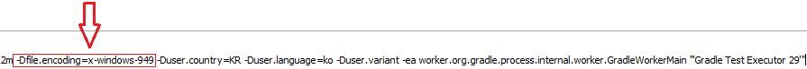

# Gradle build 시 Test 코드 인코딩이 UTF-8로 인코딩 되지 않는 이유(실제 빌드시와 디버깅 시 테스트 결과가 다른 이유)

```java
@Test
@DisplayName("base64 로 인코딩 된 문자열에 +,/ 문자가 포함되어 있지 않은 경우를 base64UrlSafe 디코딩시 문제 없이 디코딩이 이뤄진다")
void testBase64ToBase64UrlSafe_whenPlusAndSlashNotInEncoded_thenSusscess() {

    String sourceText = "저의이름은신우섭입니다";

    byte[] encoded = Base64.getEncoder().encode(sourceText.getBytes());
    String encodedText = new String(encoded);

    System.out.println("Base64 Encoded : " + encodedText);

    assertThat(encodedText).doesNotContain("+").doesNotContain("/");

    String decodeText = new String(Base64.getUrlDecoder().decode(encoded));
    assertThat(decodeText).isEqualTo(sourceText);
}
```

위와 같은 테스트 코드를 IDE상에서 실행시켰을때는 정상적으로 통과하였으나,
`gradlew.build` 를 통하여 빌드 시 컴파일 후 실행되는 테스트에서는 통과하지 못하는 현상이 발생했습니다.

로그를 찍어보니 `String sourceText = "저의이름은신우섭입니다";` 가
IDE 에서 테스트 코드를 실행 시킬 때는 `UTF-8` 로 인코딩되고
`gradlew.build`로 실행 시킬 때는 `OS 의 기본 인코딩` 을 사용하여 `EUC-KR` 로 인코딩되었습니다.

위 문제를 해결하기 위하여 공식문서를 참고하여 아래와 같이 코드를 추가하였습니다.

> **compileTestJava — JavaCompile**
> Depends on: classes, and all tasks that contribute to the test compilation classpath
> Compiles test Java source files using the JDK compiler.

```groovy filename="build.gradle"
compileJava.options.encoding = "UTF-8"
compileTestJava.options.encoding = "UTF-8"
```

하지만 여전히 해결되지 않았습니다.

실제로 `build.gradle` 을 `--debug` 로 실행해보니

```text
2023-11-03T18:39:05.339+0900 [DEBUG] [org.gradle.api.internal.tasks.compile.NormalizingJavaCompiler]
Compiler arguments: -source 17 -target 17 -d F:\project\00\new\sample\java-rest-capi\app\build\classes\java\test -encoding UTF-8
```

과 같이 `-encoding UTF-8` 로 인코딩은 지정되었습니다.

그러나 여전히 `String sourceText = "저의이름은신우섭입니다";` 부분이 `EUC-KR`로 인코딩되고 있었습니다.

이제 의심되는 부분은 `build.gradle` 시 호출되는 `test` Task는 독립적으로 `Test.java` 파일을 컴파일하고 이 때 `OS의 기본 인코딩을 사용한다` 라는 가설을 세웠습니다.

## 프로세스 모니터를 이용한 확인

그러면 실제로 **java 옵션 `-Dfile.encoding`** 또는 **javac 옵션 `-encoding`** 으로 `EUC-KR`이 사용되고 있을 것이라고 예상하고

프로세스 모니터를 통하여 프로세스 실행 인자를 `-Dfile.encoding`, `-encoding` 두 키워드로 찾아봤습니다.





```text
-Dfile.encoding=x-windows-949
-Duser.country=KR
-Duser.language=ko
-Duser.variant -ea
worker.org.gradle.process.internal.worker.GradleWorkerMain "Gradle Test Executor 29"
```

찾아본 결과 위와 같은 내용을 발견하였는데

`java.exe` 를 실행시키면서 인자로 `-Dfile.encoding=x-windows-949` 과 같이 현재 `OS 기본 인코딩` 을 사용하고 있습니다.

여기보면 `Gradle Test Executor 29` 라는 키워드가 해당 명령어를 실행시키고 있는 **프로세스 이름**인데 

찾아보니 gradle에서 **테스트를 병렬로 실행하기 위한 작업 프로세스** 라고 합니다.

그래서 `29` 라는 넘버링을 달고 있는 것이고, 테스트가 N개로 많을 수 있기에 저 `29`라는 넘버링도 여러개가 존재할 겁니다

현재는 최소 `Gradle Test Executor 1~29` 라는 작업 프로세스들이 존재했을 수 있습니다.

## 그렇다면 해결 방법은?

```groovy filename="build.gradle"
compileJava.options.encoding = "UTF-8"
compileTestJava.options.encoding = "UTF-8"
```

찾아보니 위와 같이 gradle plugin extension properties 로 깔끔하게 지정하는 방법은 **안타깝게도 없는 것 같고**

아래와 같이 **java 실행 args** 로 지정해야하는 것 같습니다.

```groovy
test {
    systemProperty 'file.encoding', 'UTF-8'
}
```

이렇게 지정하면 `gradlew build` 명령어로 빌드 완료 후 진행되는 테스트도 `UTF-8` 로 진행되는 걸 확인할 수 있었습니다.


## 정리

**gradle 이 테스트를 위해 실행시키는 Gradle Test Executor 라는 작업 프로세스가 독립적으로 java.exe 를 실행시켜서 테스트를 실행하는데,
이때 기본 인코딩 값이 `OS 기본 인코딩`** 인 것을 확인했습니다.


