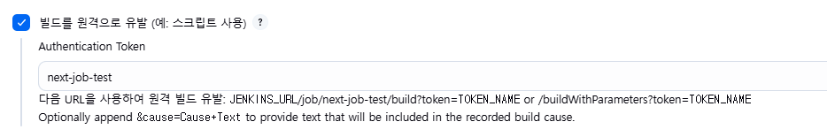
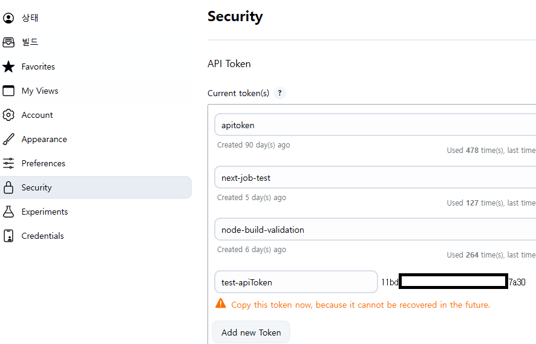

# 젠킨스 빌드 원격으로 유발 사용 시 HTTP ERROR 403 No valid crumb was included in the request 가 발생하는 이유

외부에서 젠킨스 빌드를 원격으로 유발 시키고자 하였는데

  

`curl` 로 호출 했을 때 `HTTP ERROR 403 No valid crumb was included in the request` 오류가 발생해서 이유를 찾아봤다

## CSRF Protection : Default Crumb Issuer

`Jenkins 관리 > Security` 를 들어가보면 `CSRF Protection` 항목을 찾을 수 있는데

이 값이 `Default Crumb Issuer` 로 지정되어있었다.

Jenkins 자체를 구축하고 셋팅한 인원은 따로 있었기에 이게 기본값인지는 모르겠지만 위 설정이 되어있을 경우

단순히 `JENKINS_URL/job/next-job-test/build?token=TOKEN_NAME or /buildWithParameters?token=TOKEN_NAME` 형태의 요청만으로는 빌드를 실행할 수 없다

## 해결방법

[젠킨스 CSRF Protection 공식문서](https://www.jenkins.io/doc/book/security/csrf-protection/) 를 참고해보면 

두가지 방법이 설명되어있는데

1. `/crumbIssuer/api`에 요청을 보내 `crumb`를 발급받은 후 사용한다
2. `사용자 이름`과 `API 토큰`을 사용하여 인증한다. (API 토큰 으로 인증하는 요청은 Jenkins의 CSRF 보호 대상에서 제외됩니다.)

> 여기서 `crumb` 란 젠킨스에서 CSRF 방지를 위해 발급하는 `Token`을 칭하는 용어이다

필자는 처음에 `crumb` 를 발급 받아 사용하려했는데 발급 요청에도 `사용자 이름`과 `API 토큰`을 통한 인증이 필요하다
그렇다면 굳이 `1` 번 방법을 채택할 필요가 있을까?

**1번**을 채택할 경우
1. `사용자 이름`과 `API 토큰`을 이용하여 `crumb` 발급 요청
2. `crumb` 를 이용하여 `젠킨스 빌드 원격으로 유발`

**2번**을 채택할 경우
1. `사용자 이름`과 `API 토큰`을 이용하여 `젠킨스 빌드 원격으로 유발`

어차피 `사용자 이름`과 `API 토큰` 이 **최소 1회**는 필요한데 복잡하게 스텝 하나가 더 추가되는 느낌이 든다 (**물론 매번 요청마다 일종의 ID/PW와 같은 정보가 딸려가는게 위험할 수 있으나 `HTTPS` 를 믿는다**)

그렇기에 필자는 `2`번 방법을 사용하기로 했다

### 해결방법 : 사용자 이름 과 API 토큰을 이용하여 빌드 원격으로 유발

[젠킨스 클라이언트 인증](https://www.jenkins.io/doc/book/system-administration/authenticating-scripted-clients/)을 참고해보면

`curl -X POST -L --user your-user-name:apiToken https://jenkins.example.com/job/your_job/build` 

위와 같은 형식으로 요청할 수 있는데 약간 문서가 불친절한 부분이..
`your-user-name:apiToken` 를 **base64 인코딩** 을 해야한다는 내용이 설명에는 없고 본문 아래의 `Axios를 사용한 TypeScript 스크립트 예제`의 코드를 직접 봐서 확인해야하는 부분이 있다

코드의 일부분을 보면

```js
const credentials = `myusername:myapitoken`;
// ~~~ 기타 코드 생략
const base64Credentials = btoa(credentials);
const authHeader = `Basic ${base64Credentials}`;
```

위와 같은 코드를 찾을 수 있다

여기서 사용되는 `apiToken` 은

젠킨스 `개인 계정 설정 > Security` 에서 등록할 수 있는 `apiToken` 의 값이다

  


