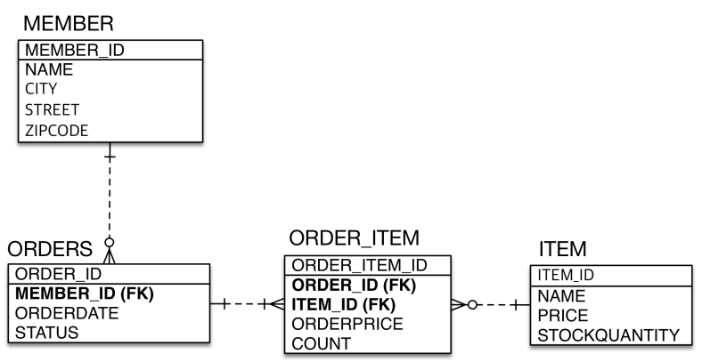
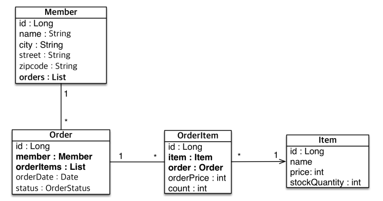

import { Callout } from "nextra/components";

# 자바 ORM 표준 JPA 프로그래밍 (4) - 연관관계 매핑 기초

## 목표

• 객체와 테이블 연관관계의 차이를 이해
• 객체의 참조와 테이블의 외래 키를 매핑
• 용어 이해
• **방향(Direction)**: 단방향, 양방향
• **다중성(Multiplicity)**: 다대일(N:1), 일대다(1:N), 일대일(1:1),
다대다(N:M) 이해
• **연관관계의 주인(Owner)**: 객체 양방향 연관관계는 관리 주인
이 필요

## 연관관계가 필요한 이유

> **‘객체지향 설계의 목표는 자율적인 객체들의 협력 공동체를 만드는 것이다.’**
> –조영호(객체지향의 사실과 오해)

## 객체를 테이블에 맞추어 모델링 (연관관계가 없는 객체)

- **FK(외래키)** 가 있는 쪽이 N이다


```java filename='Member.java'

    @Entity
    public class Member {

        @Id @GeneratedValue
        private Long id;

        private Long teamId;
    }

```

```java filename='Team.java'
    @Entity
    public class Team {

        @Id @GeneratedValue
        private Long id;
    }
```

위와 같이 pk로 id값을 직접 가지고 있을 경우

Member의 Team 정보를 알고 싶으면

1. Member 를 조회한다
2. 조회된 Member 의 teamId를 가져와서 다시 Team 을 조회한다

와 같이 쿼리가 두번 발생하고 코드 라인도 길어지는 문제가 있습니다.

## 객체 지향 모델링 (객체 연관관계 사용)

```java filename='Member.java'

    @Entity
    public class Member {
        @Id @GeneratedValue
        private Long id;

        @ManyToOne
        @JoinColumn(name = "id")
        private Team team;
    }

```

와 같이 코드를 수정하면 아래와 같이 변경됩니다.

<Callout type="info" emoji="🧑🏻‍💻">
  `@ManyToOne`, `@OneToMany` 가 헷갈릴때 `To` 를 기준으로 왼쪽이 **현재 Entity**, 오른쪽이 Join 이 될 **target Entity** 라고 생각하면 편합니다.

@ManyToOne : 나는 여러개, 너는 하나

@OneToMany : 나는 하나에, 너는 여러개

</Callout>

### 저장

```java
Member member = new Member();
em.persist(member.setTeam(new Team().setName("TeamA")));
```

기존에는 Team entity 영속화 후 `team.getId()` 로 가져온 값을 `member.setTeamId(teamId)` 와 같이 진행했으나
이제는 Team 개체를 `member.setTeam(team)` 바로 넣으면 **jpa가 알아서 team 개체의 id값을 가져다가 쿼리를 만듭니다.**

### 조회

조회에서도 마찬가지로 `member.setTeam(team)` 을 한 후
`em.find(Member.class, member.getId());` 를 하면 jpa가 알아서

`연관관계` 정보에 따라 `@ManyToOne` `@JoinColumn` 두 어노테이션을 참고하여 **JoinQuery 를 생성합니다**

### FK 변경

만약 이미 영속화된 `Member` 개체의 `TeamId (FK)` 를 변경하고 싶으면

```java
Team newTeam = em.find(Team.class, 100L);
findMember.setTeam(newTeam);
```

하면 자연스럽게 **업데이트 쿼리가 실행**되면서 `TeamId` 가 변경됩니다

<Callout type="info" emoji="🧑🏻‍💻">
  영속성 컨텍스트에 한번 올라간 Entity의 경우 Collection 에서 값을 가져와서
  변경하듯이 **참조** 형식이라고 생각해야한다!
</Callout>

## 양방향 연관관계와 연관관계의 주인 (핵심)

### 양방향 매핑

#### 테이블에서의 양방향 매핑

테이블에서 **양방향** 연관관계는 사실상 `FK` 하나만 있어도 가능하다


위의 이미지에서 `Member 에서 Team 조회`, 반대로 `Team 에서 Member 조회` 양방향이 테이블에서 어떻게 가능한지 보자

**Member 에서 Team 조회**

```sql
select * from Member join Team on Member.teamId = Team.id;
```

**Team 에서 Member 조회**

```sql
select * from Team join Member on Team.id = Member.teamId;
```

결국 `FK` 하나로 양방향이 가능하며 단방향에서의 스키마 구조 그대로 변경없이 양방향 조회가 가능하다

그렇기 때문에 테이블에서는 사실상 **`단,양방향` 이라는 개념이 없고** 그냥 **연관이 되어있다** 라는 개념만 있다

#### 객체에서의 양방향 매핑

단, 양방향에 따라 스키마 구조가 변화없던 테이블과는 달리 객체지향에서는

단방향에서 했던 객체 구조에서 **코드를 수정해야 양방향이 가능해진다**


위 구조와 같이 `Team Entity`에 `List members` 와 같이 `member` 의 정보가 들어가야한다.

```java filename='Team.java'
    @Entity
    public class Team {

        @Id @GeneratedValue
        private Long id;

        @OneToMany(mappedBy = "team")
        private List<Member> members = new ArrayList<>();
    }
```

`mappedBy = "team"` 해석 : 나는 **"team"** 에 연결되어있다, 여기서 team은 **상대방의 필드 이름**

테스트 코드를 해보면

```java
Member findMember = em.find(Member.class, member.getId());
private List<Member> members = new ArrayList<>();
```

그런데! 한쪽은 `@JoinColumn(name = "id")` 으로 매핑했는데 왜 다른쪽은 `@OneToMany(mappedBy = "team")` 이라고 사용해야할까??

## 연관관계의 주인과 mappedBy (중요!!)

• mappedBy = JPA의 멘탈붕괴 난이도
• mappedBy는 처음에는 이해하기 어렵다.
• **객체와 테이블간에 연관관계를 맺는 차이를 이해해야 한다.**

### 객체와 테이블이 관계를 맺는 차이

• **객체 연관관계 = 2개**
• 회원 `-->` 팀 연관관계 **1개(단방향)**
• 팀 `-->` 회원 연관관계 **1개(단방향)**

사실 양방향이라는 말 보다는 **단방향 관계가 두개** 라는 말이 더 맞다


• **테이블 연관관계 = 1개**
• 회원 `<-->` 팀의 연관관계 **1개(방향이 없다!)**

위에서 알아봤던 것 처럼 테이블에서는 **FK 한개** 로 양방향을 나타낼 수 있다


### 객체의 양방향 관계

• 객체의 양방향 관계는 사실 양방향 관계가 아니라 **서로 다른 단뱡향 관계 2개다.**

• 객체를 양방향으로 참조하려면 **단방향 연관관계를 2개** 만들어야 한다.

• A -> B (a.getB())
• B -> A (b.getA())

```java
class A {
    B b;
}

class B {
    A a;
}
```

### 테이블의 양방향 연관관계

• 테이블은 **외래 키 하나**로 두 테이블의 연관관계를 관리

• MEMBER.TEAM_ID **외래 키 하나로 양방향 연관관계 가짐**(양쪽으로 조인할 수 있다.)

```sql
select * from Member M join TEAM T on M.TEAM_ID = T.TEAM_ID
```

```sql
select * from Team T join Member M on T.TEAM_ID = M.TEAM_ID
```

### 둘 중 하나로 외래 키를 관리해야 한다.


**회원**이 소속된 **팀** 이 변경되었을 때
이를 코드로 반영하려면

`Team`의 `members`를 변경해도 되고
반대로
`Member`의 `team`을 변경해도 됩니다.

둘다 변경해도 결과가 같다면 어떤걸로 변경할지 **선택 장애**가 옵니다.

이때 **연관관계의 주인(Owner)** 의 개념이 나옵니다.

### 연관관계의 주인(Owner)

**양방향 매핑 규칙**
• 객체의 두 관계중 하나를 연관관계의 주인으로 지정
• **연관관계의 주인만이 외래 키를 관리(등록, 수정)**
• **주인이 아닌쪽은 읽기만 가능**
• 주인은 mappedBy 속성 사용X
• 주인이 아니면 mappedBy 속성으로 주인 지정

다시 한번 `mappedBy` 라는 영어를 해석해보면 `mapped` 맵핑 되었다, `By` by에 의해 즉, `나는 주인에의해 맵핑되었다!` 라는 해석이 가능하다

### 누구를 주인으로?

- **외래 키가 있는 있는 곳**을 주인으로 정해라
- 여기서는 **Member.team**이 연관관계의 주인
- **ManyToOne** 에서 **Many** 가 주인이다


### 양방향 매핑시 가장 많이 하는 실수

- 연관관계의 주인에 값을 입력하지 않음
- **읽기 전용**에 (mappedBy 필드) 값을 넣어도 바뀌지 않는다.
- **읽기 전용**은 jpa에서 쿼리 나갈때 insert query를 생성하지 않는다

```java

Team team = new Team();
team.setName("TeamA");
em.persist(team);

Member member = new Member();
member.setName("member1");

//역방향(주인이 아닌 방향)만 연관관계 설정
team.getMembers().add(member);

em.persist(member);

```


### 양방향 매핑시 연관관계의 주인에 값을 입력해야 한다.

- 순수한 객체 관계를 고려하면 항상 양쪽다 값을 입력해야 한다.

#### 왜??

```java
Team team = new Team();
team.setName("TeamA");
em.persist(team);

Member member = new Member();
member.setUsername("member1");
member.setTeam(team);
em.persist(member);

em.flush();
em.clear();

Team findTeam = em.find(Team.class, team.getId());
List<Member> members = findTeam.getMembers();

for (Member m : members) {
    System.out.println("m = " + m.getUsername());
}

tx.commit();
```

위 코드에서 `Team` 따로, `Member` 따로 영속화를 하고,
`Team`을 조회해서 `getMembers()` 를 하면 `null`이 나올 것 같지만 결과는 `Member` **객체가 정상적으로 반환**된다. 왜?

jpa는 `mappedBy` 가 되어있는 `members` 필드에 대해서 `get()` 호출 시 `외래키(FK)`를 기준으로 `Select Query` 를 실행합니다

그렇기 때문에

`Team findTeam = em.find(Team.class, team.getId());` 에서 **쿼리 한번**

`List<Member> members = findTeam.getMembers();` 에서 **쿼리 한번** 총 두번의 조회 쿼리가 실행됩니다.

#### 정상 적으로 조회된다고 하면 양쪽 모두 값을 입력할 필요가 없는거 아닌가?

양쪽 모두 값을 넣지 않을 경우 **두 가지의 문제가 발생합니다**

**1. em.flush(), em.clear() 를 하지 않을 경우 1차 캐시의 값이 조회되어 빈값이 조회됨**

```java
Team team = new Team();
team.setName("TeamA");
em.persist(team);

Member member = new Member();
member.setUsername("member1");
member.setTeam(team);
em.persist(member);

// em.flush();
// em.clear();

Team findTeam = em.find(Team.class, team.getId()); // DB가 아닌 1차 캐시(메모리)에서 조회
List<Member> members = findTeam.getMembers();

for (Member m : members) {
    System.out.println("m = " + m.getUsername());
}

tx.commit();
```

위 코드와 같이 `flush()와 clear()` 를 진행하지 않을 경우 `Team findTeam = em.find(Team.class, team.getId());` 는 `1차 캐시` 에서 조회하기 때문에
FK를 기준으로 조회하고 뭐 이런게 없음
그냥 순수하게

```java
Team team = new Team();
team.setName("TeamA");
```

로 생성된 `team` 객체를 그대로 가져오는 것, 그렇기 때문에 `members` 필드는 당연히 **비어있는 상태**

**2. JPA를 사용하지 않고 순수한 자바코드 상태에서 테스트 코드 작성 시**

해당 경우에도 **순수한 자바코드** 상태에서 쓰기 때문에 동일한 문제가 발생함

#### 양쪽 다 값을 입력한 올바른 모습

```java

Team team = new Team();
team.setName("TeamA");
em.persist(team);

Member member = new Member();
member.setName("member1");

team.getMembers().add(member); // 양쪽 다 값 입력
member.setTeam(team);

em.persist(member);

```


### 양방향 연관관계 주의 - 실습

- **순수 객체 상태를 고려해서 항상 양쪽에 값을 설정하자**
- **연관관계 편의 메소드를 생성하자**
- **양방향 매핑시에 무한 루프를 조심하자**
  - 예: toString(), lombok, JSON 생성 라이브러리

### 연관관계 편의 메소드

```java

Member member = new Member();
member.setUsername("member1");
member.setTeam(team);
```

여기서 사용되는 `member.setTeam(team);` 대신 `changeTeam(Team team)` 이라는 함수를 만들어서

```java
class Member {
    public void changeTeam(Team team) {
        this.team = team;
        team.getMembers().add(this) // 매개변수로 받은 team 객체의 mebers 필드에 member를 넣어줌
    }
}
```

그러면

```java
Team team = new Team();
team.setName("TeamA");
em.persist(team);

Member member = new Member();
member.setName("member1");
member.changeTeam(team);

em.persist(member);
```

과 같이 `team.getMembers().add(member);` 코드를 삭제해도 됨.

> 주의! 연관관계 편의 메소드는 한쪽에만 있어야함!

### 양방향 매핑시에 무한 루프를 조심하자

```java
class Member {
    @Override
    public String toString() {
        return "Member{" +
            "id=" + id +
            ", username='" + username + '\'' +
            ", team=" + team + // team.toString()
            '}';
    }
}
```

```java
class Team {
    @Override
    public String toString() {
        return "Team{" +
            "id=" + id +
            ", name='" + username + '\'' +
            ", members=" + members + // member.toString()
            '}';
    }
}
```

라이브러리를 통해서 `toString()` 함수를 자동 생성하면 보통 위와 같이 만들어지는데,

`", team=" + team + // team.toString()` -> `", members=" + members + // member.toString()` -> `", team=" + team + // team.toString()` -> `", members=" + members + // member.toString()` ...

위 구조로 무한 재귀에 빠질 수 있다.

<Callout type="error" emoji="❗❗❗">
  **JSON 생성 라이브러리 또한 마찬가지**

    양방향 관계를 가진 Entity를 Controller에서 `return ResponseEntity<양방향관계 Entity>` 바로 해버리면,
    무한 루프에 빠질 수 있음!
    그렇기 때문에 항상 `양방향관계 Entity -> ResponseDto` 로 변환한 후 `return ResponseEntity<ResponseDto>` 를 습관화 하는게 좋음!

</Callout>

<Callout type="info" emoji="🧑🏻‍💻">
  **Controller에서 Entity를 반환하면 안되고 ResponseDto 를 반환하는 이유!**

    1. 양방향 연관관계를 갖는 Entity의 경우 JSON으로 변환하면서 무한 루프에 빠질 수 있다
    2. Entity는 스펙이 변할 수 있는데 Entity 스펙이 변하면서 API 스펙이 같이 변하는 문제가 있다

</Callout>

#### 양방향 매핑 정리

- **단방향 매핑만으로도 이미 연관관계 매핑은 완료**
- 양방향 매핑은 반대 방향으로 조회(객체 그래프 탐색) 기능이 추가된 것 뿐
- JPQL에서 역방향으로 탐색할 일이 많음
- 단방향 매핑을 잘 하고 양방향은 필요할 때 추가해도 됨(테이블에 영향을 주지 않음)

<Callout type="info" emoji="🧑🏻‍💻">
  **JPA 모델링 할 때 일단은! 단방향 매핑만으로 설계를 끝내야한다! 양방향 매핑 사용하면 안됨!**

    그러면 양방향은 언제쓰냐?
    **JPQL에서 역방향으로 탐색할 일이 많음** 이럴 때 사용함
    단방향 매핑을 잘 하고 **양방향은 필요할 때 추가**해도 됨(테이블에 영향을 주지 않음)

    단방향 매핑
    

    양방향 매핑
    

    단방향에서 양방향으로 변했을 때 **테이블 연관관계** 는 **전혀 변함이 없다** 그러니 **양방향은 필요할 때 추가해도 됨!**

    객체 입장에서 **양방향 연관관계는 이점이 없다**

</Callout>

#### 연관관계의 주인을 정하는 기준

- 비즈니스 로직을 기준으로 연관관계의 주인을 선택하면 안됨

- **연관관계의 주인은 외래 키의 위치를 기준으로 정해야함**

<Callout type="info" emoji="🧑🏻‍💻">
  **그냥 닥 "FK" 가지고 있는 쪽이 주인!!**
</Callout>

---

## 실전 예제 - 연관관계 매핑 시작

### 테이블 구조



### 객체 구조



- 실무에서 `Member` 객체가 `Order` 객체를 알아야하는 `양방향 연관관계` 매핑은 잘못된 설계다

  <Callout type="info" emoji="🧑🏻‍💻">
  **복잡한 연관관계를 잘 끊을 줄 알아야 한다**

  `Member` 입장에서 **이 Member가 어떤 주문을 했지?** 를 검색하기 위하여
  `Member` 객체가 `List<Order> orders` 를 갖게하면 복잡도가 끝이 없다.

  `Order` 객체가 알고있는 `Member FK`가지고 **이 Member가 어떤 주문을 했지?** 를 검색해야한다.
  즉, `SELECT * FROM Order o join Member m on o.memberId = m.id where o.memberId = wusub.shin` 와 같이 `Order`로 부터 **이 Member가 어떤 주문을 했지?** 의 결과값을 도출해 낼 수 있고, 실제로 그렇게 해야한다.

  </Callout>
