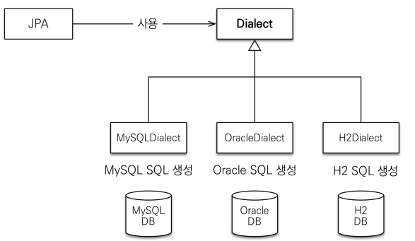
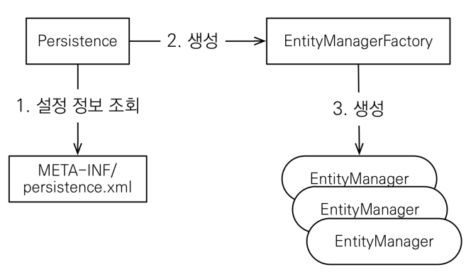

# JPA 시작하기

김영한님의 인프런 jpa 강의를 듣고 정리한 내용입니다.

## JPA를 구현한 hibernate

JPA 는 인터페이스다, 이를 구현한 무엇인가를 사용해야 한다
그것이 바로 hibernate

---

## JPA 설정하기

### dialect(방언, 사투리)

```
    <property name="hibernate.dialect" value="org.hibernate.dialect.H2Dialect" />
```

방언 : SQL 표준을 지키지 않는 특정 데이터베이스만의 고유한 기능

데이터베이스 종류에 따른 방언(dialect) 을 지정해주면 JPA가 **"아~ 너 제주도(MySQL) 방언을 쓰는구나 내가(JPA) 방언은 알아서 해석할게~"** 하는 것

  

---

## JPA 구동 방식

  

### Persistence

### 주의

**EntityManagerFactory**: 애플리케이션 전체에서 하나만 생성해서 사용 (싱글톤)

**EntityManager** : 쓰레드간에 공유X(사용하고 버려야한다)

**JPA의 모든 데이터 변경은 트랜잭션 안에서 실행**

## JPQL

- JPA를 사용하면 엔티티 객체를 중심으로 개발

- 문제는 검색 쿼리

- 검색을 할 때도 테이블이 아닌 엔티티 객체를 대상으로 검색

- 모든 DB 데이터를 객체로 변환해서 검색하는 것은 불가능

- 애플리케이션이 필요한 데이터만 DB에서 불러오려면 결국 검색 조건이 포함된 SQL이 필요

- JPA는 SQL을 추상화한 JPQL이라는 객체 지향 쿼리 언어 제공

- JPQL은 엔티티 객체를 대상으로 쿼리

- SQL은 데이터베이스 테이블을 대상으로 쿼리

**JPA는 테이블 대상으로 절대 쿼리를 짜지 않는다, 객체(Entity)를 대상으로 쿼리를 만들어낸다**
