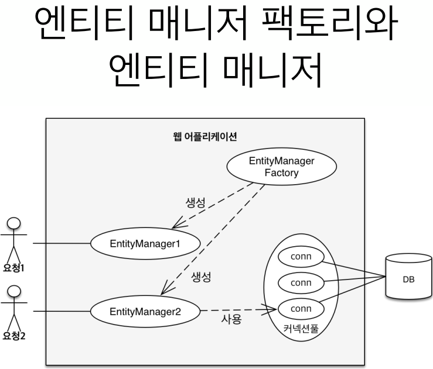
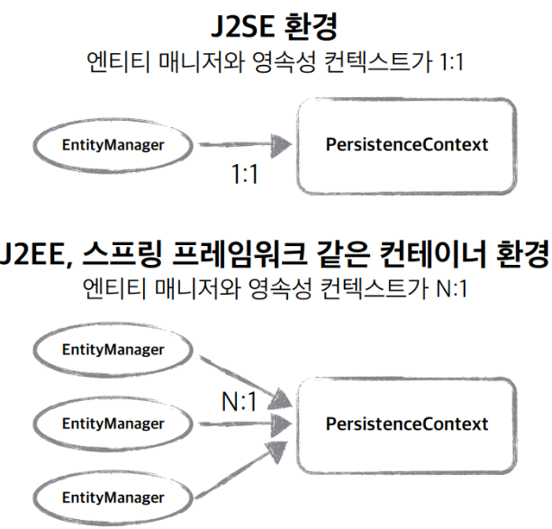
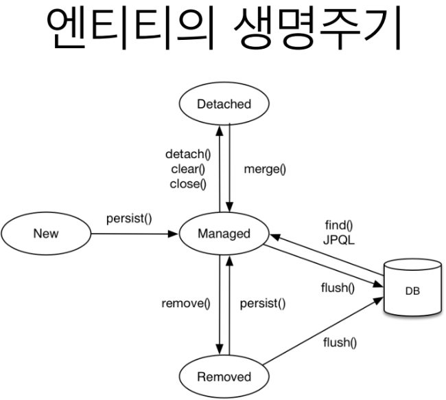
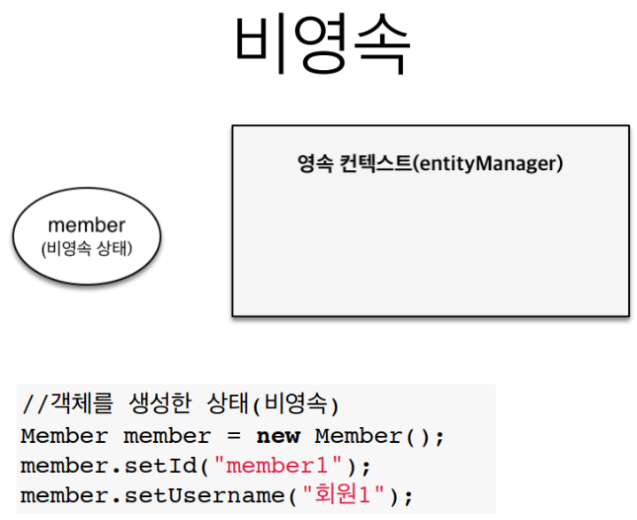
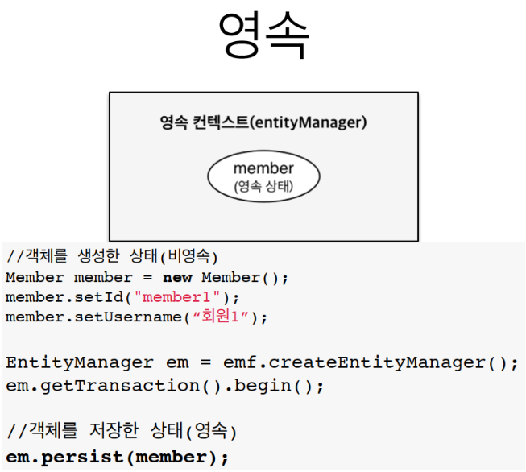
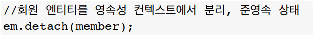
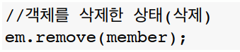

# JPA 영속성 관리 내부 동작 방식

김영한님의 인프런 jpa 강의를 듣고 정리한 내용입니다.

## JPA에서 가장 중요한 2가지

- 객체와 관계형 데이터베이스 매핑하기 (Object Relational Mapping)
- **영속성 컨텍스트**

  

---

## 영속성 컨텍스트 1

- JPA를 이해하는데 가장 중요한 용어
- **"엔티티를 영구 저장하는 환경"** 이라는 뜻
- **`EntityManager.persist(entity);` :  Entity 를 DB에 저장하는게 아니라 영속성 컨텍스트에 저장하는 것이다**

---

## 엔티티 매니저? 영속성 컨텍스트?

- 영속성 컨텍스트는 논리적인 개념
- 눈에 보이지 않는다.
- 엔티티 매니저를 통해서 영속성 컨텍스트에 접근

**엔티티 매니저 생성 시 내부적으로 PersistenceContext(영속성 컨텍스트) 가 생성된다.**

  

---

## 엔티티의 생명주기

  

### 비영속 (new/transient)

영속성 컨텍스트와 전혀 관계가 없는 **새로운** 상태

예시 : JPA 전혀안쓰고 그냥 Entity 객체만 생성해놓는 것

  

### 영속 (managed)

영속성 컨텍스트에 **관리**되는 상태

  

### 준영속 (detached)

영속성 컨텍스트에 저장되어았다가 **분리**된 상태

  

### 삭제 (removed)

**삭제**된 상태

  
