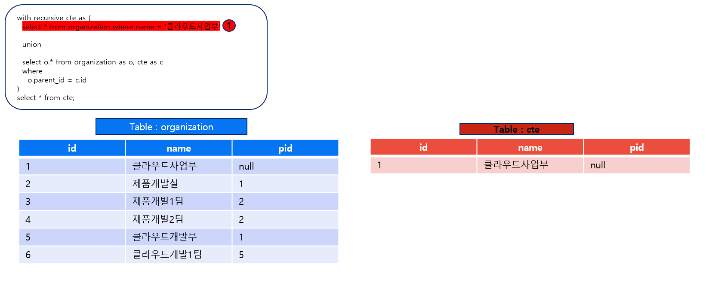
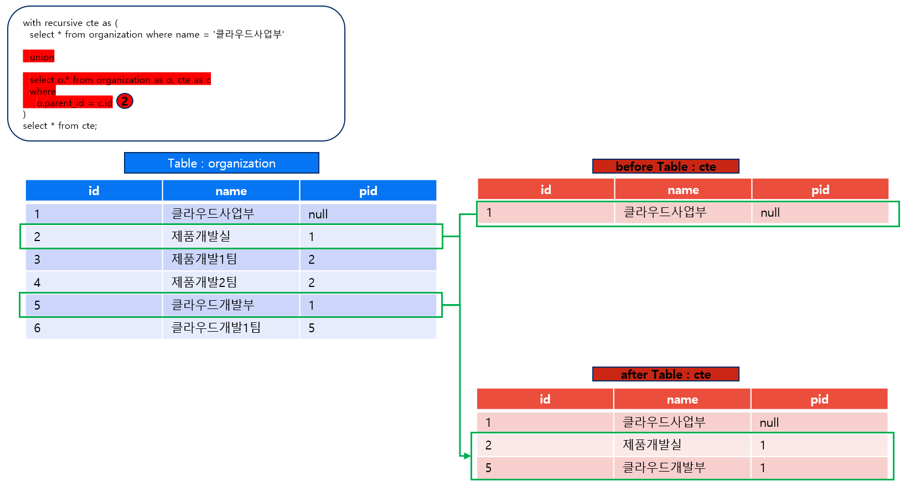
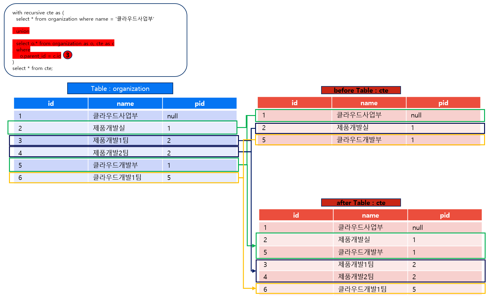

# jpa 사용시 계층형 데이터 조회하기


"조직" 이라는 정보의 경우 계층형 구조를 갖을 가능성이 높습니다.
예를 들어 **"OOO사업본부 000부서 000팀"** 과 같이 **사업본부 > 부서 > 팀**과 같이 데이터가 존재할 수 있습니다.
이 데이터를 jpa를 이용하여 db에서 조회 할 때 어떻게 해야하는지 알아보았습니다.

## 재귀 쿼리의 예시

```sql
with recursive cte as (
  select *
  from organization
  where name = '클라우드사업부'

  union

  select o.*
  from organization as o, cte as c
  where o.parent_id = c.id
)

select *
from cte;
```

## 재귀쿼리가 실행되는 순서를 그림으로 확인해보자

  

  

  
