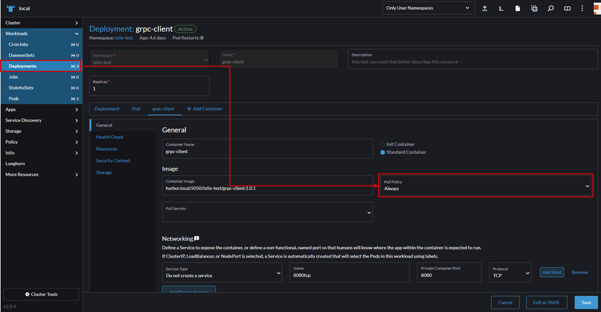

# 도커 이미지를 registry 에서 pull 했을때의 캐시없이 항상 pull 하는 방법 (pull policy)

도커 이미지를 registry 에서 pull했는데, 바뀌지 않는 현상이 발생하는 경우가 있습니다

예를들어, `docker-image-test-1.0.0` 이란 image를 push했는데, 내용물이 잘못되어(?) 수정 후 똑같은 `docker-image-test-1.0.0` 로 push 했을 경우

이 중간에 누군가가 앞서 잘못 올라간 `docker-image-test-1.0.0` 를 `pull` 하고, 이후에 `docker-image-test-1.0.0` 를 다시 `pull` 할게되면

기존에 잘못 올라간 image에서 수정된 최신 image로 변경이 안되는 경우가 있습니다.

문제가 발생하는 순서를 간략하게 보자

`잘못된 docker-image-test-1.0.0 push` --> `사용자A가 image pull` --> `수정된 docker-image-test-1.0.0 push` --> `사용자A가 다시 image pull(pull Policy : IfNotPresent)` --> `이미지가 변경되지 않는 Error!`

## image pull policy

### Always
Kubernetes는 항상 이미지를 풀합니다. 컨테이너가 시작될 때마다 이미지가 로컬에 존재하는지 확인하고, 없으면 레지스트리에서 이미지를 새로 풀어옵니다. 주로 최신 이미지를 항상 사용해야 할 때 사용합니다.
```yaml
imagePullPolicy: Always
```

### IfNotPresent
Kubernetes는 이미지를 로컬에 없을 때만 이미지를 풀합니다. 로컬에 이미지가 있으면, 이미지를 새로 다운로드하지 않습니다. 기본값은 latest 태그를 사용할 때 IfNotPresent입니다.
```yaml
imagePullPolicy: IfNotPresent
```

### Never
Kubernetes는 이미지를 절대로 풀지 않습니다. 이미지가 로컬에 존재해야만 컨테이너가 실행됩니다. 만약 로컬에 해당 이미지가 없으면 컨테이너가 시작되지 않습니다. 개발 환경에서 테스트할 때 유용합니다.
```yaml
imagePullPolicy: Never
```

## Deployment Sample
```yaml
apiVersion: apps/v1
kind: Deployment
metadata:
  name: my-deployment
spec:
  replicas: 1
  selector:
    matchLabels:
      app: my-app
  template:
    metadata:
      labels:
        app: my-app
    spec:
      containers:
        - name: my-container
          image: my-repo/my-image:latest
          imagePullPolicy: IfNotPresent  # imagePullPolicy 설정
```

### 파일을 변경하지 않고 kubectl apply 에 옵션으로는 불가능한가?

찾아봤는데 옵션 없는듯, yaml 임시 변경후 원복식으로 사용해야할 것 같음. 이건 좀 불편해보인다

## 부록

### rancher 를 사용할 경우

  
