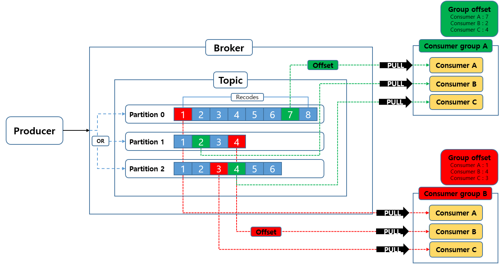
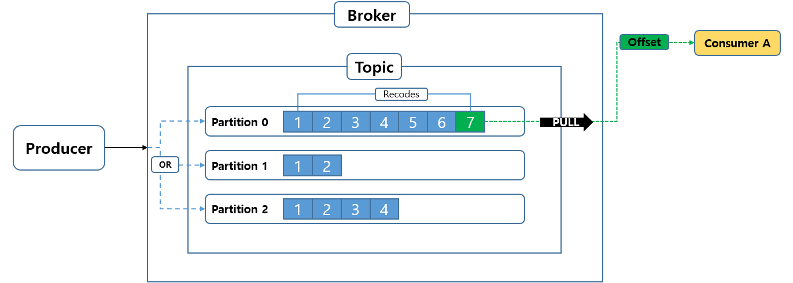
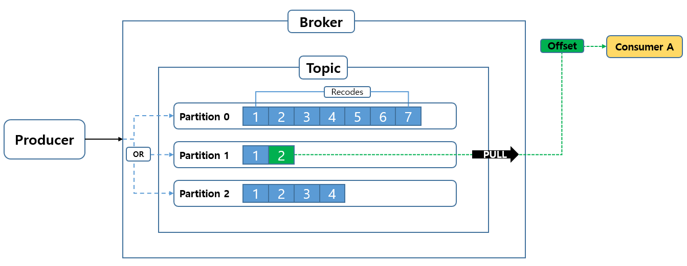
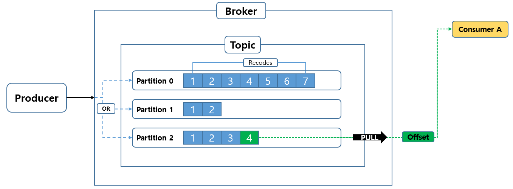
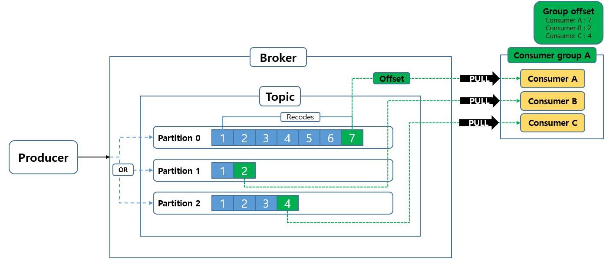
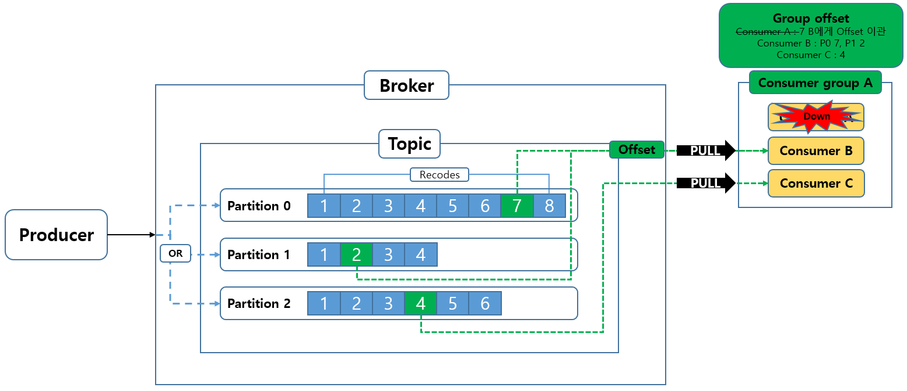

# kafka 기본개념 정리

kafka 를 사용하는 프로젝트를 단발성으로 진행하고 오랜시간 사용을 안하니 까먹은 것 같아서 리마인드 용도로 작성하였습니다.

## 메세지 큐 (Message Queue)

메세지를 임시 저장하는 공간이라고 보면 됩니다.

생성된 메세지를 바로 처리 할 수 없는 경우가 발생할 수 있으니

생성된 메세지를 임시 저장소에 저장해두고 이 메세지를 수신하는 측이 현재 메세지를 받을 수 있는 상황이면 뒤 늦게 꺼내갈 수 있도록 하는 역활을 합니다.

kafka는 이 메세지 큐의 한 종류 입니다.

---

## kafka 아키텍처

그럼 kafka 가 어떻게 구성되어있는 알아보겠습니다.

### publisher, consumer, broker

비동기 모델을 사용해보셨거나, 반응형 등에 공부해봤던 분들은 익숙하실 수 있습니다.

* **publisher** : 메세지를 생성하는 역할입니다.
* **consumer** : 메세지를 소비하는 역할입니다.
* **broker** : 메세지를 저장하고, publisher 와 consumer 간의 통신을 중개해주는 역할입니다

여기서 **broker** 라는 개념이 좀 생소하실 수 있습니다.
영화나 드라마에서보면 큰 규모의 거래나, 어두운 뒷거래 시 직접적인 판매자와 소비자가 1:1로 거래하는게 아니라 중개자를 두고 중개자의 조율하에 거래를하게되는데 그때 사용하는 broker 와 같은 의미입니다.

우리가 "출판사" 로 부터 신간의 책들을 구독해서 읽는 현실의 예를 들어보겠습니다.

1. **작가(publisher)** 가 **최신 it** 관련 원고를 작성 후 **출판사(broker)** 에게 작성된 원고를 넘깁니다.
2. **출판사(broker)** 는 작성된 원고를 **it** 분야를 구독하고 있는 **구독자(consumer)** 들에게 전달합니다.
3. **구독자(consumer)** 는 **출판사(broker)** 로 부터 구독하고 있던  **it** 관련 최신 책을 전달 받아 소비합니다.

여기서 특징은

- 작가와 구독자가 1:1로 거래를 하지 않습니다
- **it** 라는 주제의 책을 작성하는 작가는 **N명** 일 수 있고, **it** 라는 주제를 구독하는 구독자 역시 **N** 명일 수 있습니다

자 큰 개념은 이렇게 간단합니다.
이 개념은 대부분의 **메세지 큐** 가 공통적으로 갖는 아키텍처입니다.

자 그럼 여기서 좀더 디테일한 정보를 알아보겠습니다.

---

## 아키텍처 자세히 알아보기

- **topic** : 메세지 저장소
- **partition** : 각 토픽 당 데이터를 분산 처리하는 단위
- **record** : 메세지가 관리되는 단위
- **offset** : 파티션 내의 각 레코드를 고유하게 식별하는 순차적인 ID
- **consumer group** : consumer group 은 topic 데이터를 처리하는 consumer들의 집합
- **rebalancing** : 컨슈머 그룹 내의 각 컨슈머의 파티션 소유권 이관 작업

**topic** 이란 브로커가 **publisher** 로 부터 전달받은 메세지를 저장하는 **메세지 저장소** 입니다
이때 **topic** 은 내부적으로 **partition** 들로 구성되는데,
**kafka** 에서 생성된 메세지들은 **record** 라는 단위로 만들어져서 이 **partition** 에 **순서대로** 차곡차곡 **순차적인 Offset을 부여받고 저장됩니다**

이 **offset**은 컨슈머가 다음에 읽어올 레코드가 무엇인지 알 수 있도록 이정표 역할을 합니다.

이 offset을 잘 관리해야 데이터의 중복 및 누락을 방지할 수 있기에 굉장히 중요한 키워드입니다.

 

글로만 이해하기에는 추상적일 수 있으니 그림으로 그려봤습니다.

그림을 참고해보면, 각각의 Cousumer A, B, C들이 Partition 0, 1, 2 와 1:1 로 맵핑됩니다.
그렇다면 Consumer 별로 별도의 Offset 을 기억해야한다는 것인데 이 offset의 기억은 consumer가 아닌 **consumer group** 단위로 기억합니다.

이 consumer group 에 대하여 좀 더 자세히 알아보겠습니다.

### consumer group 의 역할과 필요성

간단하게는 **topic 데이터를 처리하는 consumer들의 집합** 입니다.

먼저 **consumer group** 의 주된 목적을 먼저 알아보면

- **병렬 처리를 통한 처리 속도 향상**
- **데이터 중복 방지**
- **고가용성**

이 되겠습니다.

#### 병렬 처리를 통한 처리 속도 향상

병렬 처리를 통한 처리 속도 향상이 어떻게 가능한지 먼저 알아보겠습니다.

partition는 **하나의 partition당 하나의 consumer**만 갖을 수 있습니다.

partition 0을 구독하는 consumer가 A, B, C 모두일 수 없습니다.

또한 consumer는 **한번에 하나의 record**만 읽어올 수 있습니다. 하나의 consumer가 동시에 여러개의 record를 읽을 수는 없습니다.

자 만약 특정 Topic 을 구독중인 consumer 가 A라는 consumer 하나만 존재하고, partition 은 0, 1, 2 총 3개 라고 가정해봅니다.

producer가 생성하는 메세지(record)는 partition 0, 1, 2에 골고루 쌓일 것이고 consumer A는 생성되는 record들을 빠짐 없이 읽어와야하기 때문에 여러 파티션에서 순차적으로 record를 pulling 할 겁니다.

  
  
  

만약 consumer 가 하나의 record 를 가져오는데 1초가 걸린다고 가정하면
총 3개의 partition에서 하나씩 record를 가져오는데 **3초**가 소비됩니다.

만약 partition 이 10개면 **10초**, partition이 더 많아질 수록 더 많은 시간이 소요될 겁니다.

이를 해결하기 위해서는 간단합니다. partition이 많아진 만큼 consumer 도 많아지면 됩니다.

그래서 partition 하나당 consumer 하나의 구조를 만드는 거죠

partition 0, 1, 2에다가 각각 consumer A, B, C가 구독하는 구조를 가정하겠습니다.

  

자 이 경우에도 똑같이 consumer 가 하나의 record 를 가져오는데 1초가 걸린다고 가정하면

3개의 partition 에서 각각 record를 하나씩, 총 3개의 record를 가져올때 **1초** 면 충분합니다.

만약 partition 이 10개일 경우 consumer 도 10개로 만들어주면 10개의 record를 가져온다해도 여전히 **1초** 면 충분합니다.

**partition 이 증가함에 따라 총 소요시간이 늘어나는 현상이 해결됩니다.**

#### 데이터 중복 방지

kafka는 **offset을 consumer group 단위로만 기억합니다.**

그렇기 때문에 consumer group가 필수입니다.

만약 consumer group 이 없을 경우 offset을 기억하지 못하고 가져왔던 데이터를 또 가져오와서 중복되는 데이터가 발생할 수 있겠죠

#### 고가용성

고가용성이라는 말을 처음 들어보신 분도 계실겁니다.

쉽게 말하자면 **"일시적인 장애가 발생해도 사용 가능한 상태를 유지하는 것"** 입니다.

예를들어 **네이버** 의 서버가 **서울 IDC에 하나**,**대전 IDC에 하나**, **부산 IDC에 하나** 총 3개의 서버로 구성중이라고 생각해봅시다.

갑자기 서울 IDC에 화재가 발생하여 서버가 하나 다운되었는데 일반 사용자들은 아무 상관없이 네이버 서비스를 사용수 있다면 이게 바로 **고가용성을 갖춘 서비스** 라고 할 수 있습니다.

kafka 는 consumer group 을 통하여 **데이터 소비에 대한 고가용성을 지원합니다(클러스터링 등도 존재하지만 일단 넘어가겠습니다)**

예를들어 consumer group A가 A, B, C 이라는 3개의 consumer 로 이뤄져 있을 때 consumer A 장애가 발생하면 같은 **consumer group**에 속한 나머지 consumer B, C 중 하나의 consumer가 A 가 구독중이던 partition을 이관받아 구독합니다. 물론 offset 정보도 이관되서 A가 읽던 record 위치에서 이어서 읽을 수 있습니다.

  

장애가 해결되어 consumer A가 다시 활성화되면 기존 consumer A가 다운된 후 consumer A 의 역할을 이관받았던 consumer B로 부터 다시 consumer A에게 역할이 이관됩니다.

결국 consumer A가 다운되기 전의 정상적이던 상황으로 복원되는거죠

이렇게 컨슈머 그룹내의 역할들을 균등하게 분배하는 작업을 **Rebalancing** 이라고 합니다.

예로 들었던 **컨슈머의 다운, 컨슈머의 재활성화 및 컨슈머 그룹에 신규 컨슈머 추가** 등으로 컨슈머 그룹의 구성원 변동이 발생할 경우에 **Rebalancing** 이 이뤄집니다.

주의할 점은 **consumer group 으로 묶인 consumer 들 간에만 가능**하다는 점 입니다.
