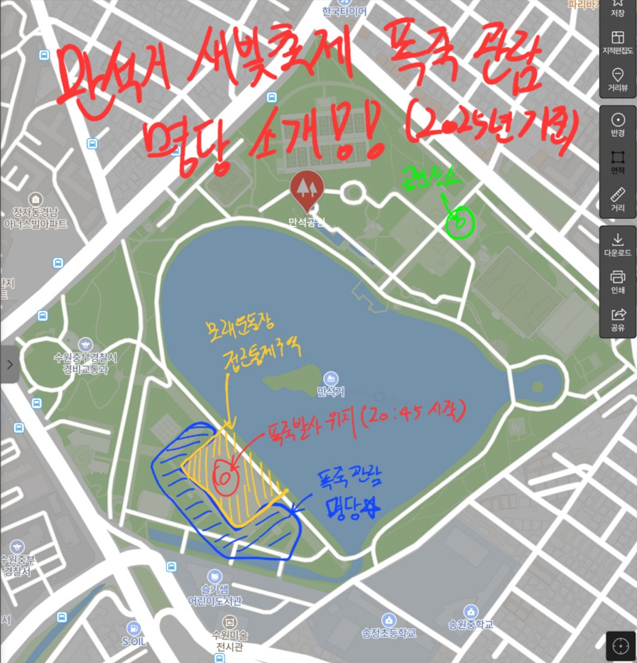

# 2025년 만석거 새빛축제 불꽃놀이 명당 기록 

2025년 기준 만석거 새빛축제 불꽃놀이 명당을 기록합니다

만석거 새빛축제의 구역은 크게 두곳으로 나뉜다

1. `공연 구역` : 초청가수들이 공연하는 곳
2. `폭죽 발사 구역` : 불꽃놀이 장소

공연은 이른시간부터 시작하여 불꽃놀이 이후까지 진행된다
공연을 관람할 사람은 공연구역 앞에서 구경하다가 폭죽 발사 **한시간** 전에는 폭죽 관람 명당으로 이동하는걸 추천한다
`공연구역`과 `폭죽 발사 구역`은 **반대 위치**에 있으니 참고하면 좋다

