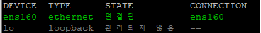

# Centos7 에서 tcpdump를 이용하여 특정 포트를 통한 패킷 발신 여부 확인하기


Centos7 환경에서 특정 포트를 통해 외부로 패킷을 발신하는 service 가 있는데 수신측에서 데이터를 받았는지 확인되지않아 실제로 패킷이 발신되는 중인지 확인이 필요한 경우가 발생하여 기록합니다.


## tcpdump

tcpdump는 대부분의 유닉스 계열에서 네트워크카드를 통해 송수신 되는 패킷을 가로채고 표시해주는 소프트웨어 입니다.  
참고로 유닉스 계열에서 TcpDump가 있다면 윈도우 계열에서는 WinDump라는 것이 있습니다.

## tcpdump 설치

tcpdump 가 설치되어있지 않다면 설치를 진행합니다.

```
yum install tcpdump
```

## 네트워크 디바이스 정보 얻기

먼저 현재 환경에서 네트워크 디바이스 정보를 알아야합니다.  
아래와 같은 터미널 명령어를 통하여 디바이스 정보를 얻을 수 있습니다.

```
nmcli d
```

명령어를 실행해보면 아래 이미지와 같이 DEVICE, TYPE, STATE CONNECTION 정보를 얻을 수 있는데 STATE가 연결됨 상태인 DEVICE 이름을 기억합니다.



## tcpdump 로 특정 포트를 통하여 발신되는 패킷 확인

이제 tcmdump 를 사용해서 특정 포트를 통하여 발신되는 중인 패킷을 확인할 수 있습니다.  
저 같은 경우 rsyslog 를 외부 서버로 보내는 중이며 포트는 45719 입니다

이때 패킷을 확인하는 방법은 아래와 같습니다.

```
tcpdump -i ens160 src port 45719
```

### tcpdump 로 특정 IP로 발신 또는 수신되는 패킷 확인

#### 특정 IP로 부터 수신되는 패킷을 확인할 경우

```
tcpdump -i ens160 src XXX.XXX.XXX.XXX
```

#### 특정 IP로 송신되는 패킷을 확인할 경우

```
tcpdump -i ens160 dst XXX.XXX.XXX.XXX
```

### 추가적으로 더 다양한 tcpdump 명령의 예

아래 링크의 블로그에 더 많은 trcpdump 명령의 예가 존재하니 참고하시면 감사하겠습니다.

[https://mkil.tistory.com/482](https://mkil.tistory.com/482)