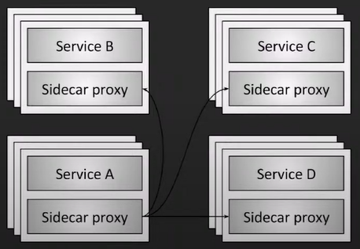

import { Callout } from "nextra/components";


# istio에 jwt 검증 proxy 추가하기


# 서비스 메시란?

- API Gateway 와 서비스 메시는 다르다, 구조가 다름
- 서비스메시의 인증은 API 게이트웨이단에서의 사용자 인증과는 거리가 멈,
허가된 사용자의 요청인지 확인하는 것은 애플리케이션 보안단(API 게이트웨이 등)에서 해야할 일이며,
서비스메시에서의 보안은 TLS 등의 패킷 자체에대한 보안으로 보임


  


## rke 환경에서 istio 설치하기

### istioctl 사용

#### istioctl 다운로드
```bash
curl -L https://istio.io/downloadIstio | sh -
cd istio-*
export PATH=$PWD/bin:$PATH
```

#### istio 설치
```bash
istioctl install --set profile=demo -y
```

#### 설치 상태 확인
```bash
kubectl get pods -n istio-system
```

출력 예시
```bash
NAME                                    READY   STATUS    RESTARTS   AGE
istio-ingressgateway-6fdd76d6d7-mz9ps   1/1     Running   0          2m
istiod-8454df4fbb-7z8xz                 1/1     Running   0          2m
```

## RequestAuthentication 와 AuthorizationPolicy 셋팅하기


### RequestAuthentication 란?

**RequestAuthentication**은 HTTP 요청에서 JWT 검증을 수행하기 위한 리소스.

```yaml filename="requestAuthentication-yaml "
apiVersion: security.istio.io/v1
kind: RequestAuthentication
metadata:
  name: httpbin
  namespace: foo
spec:
  selector:
    matchLabels:
      app: httpbin
  jwtRules:
  - issuer: "issuer-foo"
    jwksUri: https://example.com/.well-known/jwks.json
```

- `selector` : app: httpbin 라벨이 있는 Pod에 적용
- `jwtRules` : JWT 토큰의 검증 규칙을 정의
- `issuer` : JWT 토큰의 iss 클레임 값과 비교하여 발급자를 검증.
- `jwksUri` : JWT 토큰 서명을 검증하기 위한 공개 키를 포함한 JWKS URI.


### AuthorizationPolicy 란?

요청을 필터링하거나 특정 조건에 맞는 요청만 허용하기 위해 사용

**`AuthorizationPolicy` 는 `app` 별로 적용되기에 적용되어야할 `app` 이 여러개라면 똑같이 여러개의 `AuthorizationPolicy` 를 생성해야한다**

```yaml filename="authorization-policy.yaml"
apiVersion: security.istio.io/v1beta1
kind: AuthorizationPolicy
metadata:
  name: jwt-authz-policy
  namespace: my-namespace
spec:
  selector:
    matchLabels:
      app: my-app
  rules:
    - from:
        - source:
            requestPrincipals: ["*"]
      to:
        - operation:
            methods: ["GET", "POST"]
```

- `apiVersion` : Istio의 보안 리소스가 사용하는 API 버전.
- `kind` : 리소스 유형. 여기서는 AuthorizationPolicy를 정의.
- `metadata.name` : 리소스의 이름.
- `metadata.namespace` : 이 정책이 적용될 네임스페이스.
- `spec.selector` : 정책이 적용될 대상 Pod를 지정, Pod에 할당된 라벨과 matchLabels 조건이 일치하는 경우 정책이 적용.
- `spec.selector.matchLabels` : 라벨 기반 선택기. 특정 Pod를 지정하기 위해 라벨과 일치하는 조건을 설정.
- `spec.rules` : 요청을 허용하거나 차단하기 위한 규칙
- `from` : 요청의 출처를 기반으로 필터링.
- `from.source` : 요청의 출처를 정의.
- `from.requestPrincipals` : JWT 토큰의 주체 (sub 또는 iss/sub)에 따라 요청 필터링. *은 모든 요청을 허용.
- `to` : 요청의 대상(HTTP 메서드, 경로 등)을 기반으로 필터링.
- `to.operation` : 요청의 속성(HTTP 메서드, 경로 등)을 정의.
- `to.methods` : 허용할 HTTP 메서드 (예: GET, POST).
- `to.paths` : 특정 경로를 필터링.


## RequestAuthentication + AuthorizationPolicy

```yaml filename="RequestAuthentication"
apiVersion: security.istio.io/v1
kind: RequestAuthentication
metadata:
  name: httpbin
  namespace: foo
spec:
  selector:
    matchLabels:
      app: httpbin
  jwtRules:
  - issuer: "issuer-foo"
    jwksUri: https://example.com/.well-known/jwks.json
```

<Callout type="info" emoji="ℹ">
`namespace` 전체에 적용하는 쉬운 방법은 `selector: {}` 와 같이 설정하면 되는데, 이러면 `Warning: workload selector specified without labels` 경고가 발생한다, istio는 namespace전체에 그냥 냅다 적용하는 방식을 권장하지 않는 것으로 보인다
특별한 이유가 없다면 `selector.matchLabels.app` 까지 명시하는게 좋아보인다.
</Callout>


```yaml filename="AuthorizationPolicy"
apiVersion: security.istio.io/v1beta1
kind: AuthorizationPolicy
metadata:
  name: httpbin-policy
  namespace: foo
spec:
  selector:
    matchLabels:
      app: httpbin
  rules:
  - from:
      - source:
          requestPrincipals: ["issuer-foo/subject@example.com"]
```


### 등록 방법

`kubectl apply -f authorization-policy.yaml`

`kubectl apply -f peer-authentication.yaml`

#### 사이드카 주입

여기서 `사이드카`란 **소프트웨어 설계에서 주 애플리케이션 컨테이너와 함께 실행되는 보조 컨테이너를 의미한다**

jwt검증을 해주는 istio-proxy 를 각 파드별로 사이드카 등록을 해줘야한다

1. 네임스페이스에 사이드카 주입 라벨이 설정되어있는지 확인

`kubectl get namespace <namespace name> --show-labels`

출력에 istio-injection=enabled 라벨이 없으면 추가

`kubectl label namespace <namespace name> istio-injection=enabled`

2. Deployment를 다시 배포하여 사이드카가 주입되도록 변경

`kubectl rollout restart deployment <deployment name> -n <namespace name>`

3. 재배포된 Pod에 istio-proxy가 포함되었는지 확인

`kubectl describe pod <pod-name> -n <namespace name>`

#### 만약 사이드카를 해제하고 싶다면?

네이스페이스에 사이드카 주입을 비허용시키고 사이트주입을 해제하고 싶던 디플로이먼트를 재시작하면된다

1. 네임스페이스 라벨 확인

`kubectl get namespace <namespace-name> --show-labels`

2. 라벨 제거

`kubectl label namespace <namespace-name> istio-injection-`

3. Deployment를 다시 배포하여 사이드카 주입이 해제되도록 변경

`kubectl rollout restart deployment <deployment name> -n <namespace name>`

#### 아예 특정 Deployment 에 사이드카 주입이 안되도록 하려면?

해당 deploment의 yaml 에 `metadata.annotations.sidecar.istio.io/inject: "false"` 를 지정하면된다

아래는 yaml 의 예시이다

```yaml filename="sample-deployment.yaml"
apiVersion: apps/v1
kind: Deployment
metadata:
  name: example-app
  namespace: default
spec:
  replicas: 1
  selector:
    matchLabels:
      app: example-app
  template:
    metadata:
      labels:
        app: example-app
      annotations:
        sidecar.istio.io/inject: "false" # 사이드카 주입 비활성화
    spec:
      containers:
        - name: example-app
          image: example-app:latest
```

## jwt 검증을 위한 jwks 지정

### jwk 란?

`JWK`는 공개 키 또는 비밀 키를 JSON 형식으로 표현한 데이터 구조이며 [RFC 7517](https://datatracker.ietf.org/doc/html/rfc7517) 표준이다

```json filename="jwk.json"
{
  "kty": "RSA",
  "use": "sig",
  "kid": "12345",
  "alg": "RS256",
  "n": "0vx7agoebGcQSuuPiLJXZptN29WJna...",
  "e": "AQAB"
}
```

### 공통 속성 (모든 kty에 해당)

| **속성 이름** | **필수 여부** | **설명**                                                                                                   | **예시 값**                       |
|---------------|---------------|------------------------------------------------------------------------------------------------------------|-----------------------------------|
| **`kty`**     | 필수          | 키의 유형(Key Type). RSA, EC, oct(대칭 키) 등을 지정.                                                      | `"RSA"`, `"EC"`, `"oct"`         |
| **`use`**     | 선택          | 키의 용도(Key Usage). `sig`(서명), `enc`(암호화) 중 하나.                                                  | `"sig"`, `"enc"`                 |
| **`key_ops`** | 선택          | 키가 지원하는 작업(Key Operations). 예: `sign`, `verify`, `encrypt`, `decrypt`.                             | `["sign", "verify"]`             |
| **`alg`**     | 선택          | 키가 사용하는 알고리즘. JWT 헤더의 `alg`와 일치해야 함.                                                    | `"RS256"`, `"ES256"`, `"HS256"`  |
| **`kid`**     | 선택          | 키 식별자(Key ID). 여러 키 중 특정 키를 식별하기 위한 고유 값.                                              | `"rsa-key-id"`                   |
| **`x5u`**     | 선택          | X.509 인증서를 포함한 URI. 인증서를 외부에서 참조할 수 있음.                                                | `"https://example.com/cert.pem"` |
| **`x5c`**     | 선택          | X.509 인증서 체인. Base64url로 인코딩된 값 배열.                                                           | `["MIIC..."]`                    |
| **`x5t`**     | 선택          | X.509 인증서의 SHA-1 해시 값.                                                                               | `"Fv_...123"`                    |
| **`x5t#S256`**| 선택          | X.509 인증서의 SHA-256 해시 값.                                                                             | `"Vv_...456"`                    |


### RSA 키 (kty: RSA)

| **속성 이름** | **필수 여부** | **설명**                                                                                                   | **예시 값**                       |
|---------------|---------------|------------------------------------------------------------------------------------------------------------|-----------------------------------|
| **`n`**       | 필수          | RSA 키의 모듈러스(Modulus). Base64url로 인코딩된 매우 큰 정수 값.                                           | `"0vx7...9WJna"`                 |
| **`e`**       | 필수          | RSA 키의 공개 지수(Exponent). 일반적으로 `65537`이며 Base64url로 인코딩됨.                                  | `"AQAB"`                         |
| **`d`**       | 선택          | RSA 키의 개인 지수(Private Exponent). Base64url로 인코딩됨.                                                 | `"Eq5x...Gn3o"`                  |
| **`p`**       | 선택          | RSA 키 생성 시 사용된 첫 번째 소수(Prime 1). Base64url로 인코딩됨.                                          | `"1Auv..."`                      |
| **`q`**       | 선택          | RSA 키 생성 시 사용된 두 번째 소수(Prime 2). Base64url로 인코딩됨.                                          | `"4B6V..."`                      |
| **`dp`**      | 선택          | CRT 최적화 값: \( dp = d \mod (p-1) \).                                                                    | `"BwKf..."`                      |
| **`dq`**      | 선택          | CRT 최적화 값: \( dq = d \mod (q-1) \).                                                                    | `"h3wS..."`                      |
| **`qi`**      | 선택          | CRT 계수: \( qi = q^{-1} \mod p \).                                                                         | `"H9lK..."`                      |

### 타원 곡선 키 (Elliptic curve, kty: EC)
| **속성 이름** | **필수 여부** | **설명**                                                                                                   | **예시 값**                       |
|---------------|---------------|------------------------------------------------------------------------------------------------------------|-----------------------------------|
| **`crv`**     | 필수          | 타원 곡선의 이름. 예: `P-256`, `P-384`, `P-521`.                                                             | `"P-256"`                        |
| **`x`**       | 필수          | 타원 곡선의 공개 키 X 좌표. Base64url로 인코딩됨.                                                           | `"f83O...xF4F"`                  |
| **`y`**       | 필수          | 타원 곡선의 공개 키 Y 좌표. Base64url로 인코딩됨.                                                           | `"x_FE...VVjX"`                  |
| **`d`**       | 선택          | 타원 곡선의 개인 키(Private Key). Base64url로 인코딩됨.                                                     | `"Gawgg...WKav7"`                |

### 대칭 키 (kty: oct)
| **속성 이름** | **필수 여부** | **설명**                                                                                                   | **예시 값**                       |
|---------------|---------------|------------------------------------------------------------------------------------------------------------|-----------------------------------|
| **`k`**       | 필수          | 대칭 키 값. Base64url로 인코딩된 값.                                                                        | `"Gawgg...WKav7"`                |


### jwks 란?

`JWK`는 단일 키를 나타내며, 여러 키를 포함하는 경우는 **JSON Web Key Set (JWKS)**를 사용한다

[RFC 7517](https://datatracker.ietf.org/doc/html/rfc7517) 에서 Section 5 - JWK Set Format 을 참고하며되며

```json filename="jwks.json"
{
  "keys": [
    {
      "kty": "RSA",
      "use": "sig",
      "kid": "12345",
      "alg": "RS256",
      "n": "0vx7agoebGcQSuuPiLJXZptN29WJna...",
      "e": "AQAB"
    },
    {
      "kty": "EC",
      "use": "sig",
      "kid": "67890",
      "alg": "ES256",
      "crv": "P-256",
      "x": "f83OJ3D2xF4F2JfSJwsFrLWLOHkXtw...",
      "y": "x_FEzRu9VVjX9JHgBVMwD1tE44D07..."
    }
  ]
}
```

### jwks(키셋) 얻어오는 방법 

`RequestAuthentication.spec.jwtRules` 에 공개키셋을 얻어올 수 있는 uri 를 지정하면 된다
이때 얻어오는 jwks.json 또는 json body는 꼭 jwks 표준 형식을 지켜야한다

#### .json 파일을 통하여 keyset을 획득하는 방식

```yaml filename="RequestAuthenticationSample"
apiVersion: security.istio.io/v1
kind: RequestAuthentication
metadata:
  name: httpbin
  namespace: foo
spec:
  selector:
    matchLabels:
      app: httpbin
  jwtRules:
  - issuer: "issuer-foo"
    jwksUri: https://example.com/.well-known/jwks.json
```

#### json body를 반환하는 api를 통하여 keyset을 획득하는 방식

```yaml filename="RequestAuthenticationSample"
apiVersion: security.istio.io/v1
kind: RequestAuthentication
metadata:
  name: httpbin
  namespace: foo
spec:
  selector:
    matchLabels:
      app: httpbin
  jwtRules:
  - issuer: "issuer-foo"
    jwksUri: https://example.com/api/jwks
```

### jwksUri 로 부터 keyset 을 성공적으로 가져왔는지 확인하는 방법

####  Istio Control Plane (istiod) 로그 확인

- `kubectl get pods -n istio-system` 명령어로 istiod pod name 확인

```
NAME                                    READY   STATUS    RESTARTS   AGE
istio-egressgateway-568ccc69d8-ccftb    1/1     Running   0          43d
istio-ingressgateway-64fc6d787b-5lxjm   1/1     Running   0          43d
istiod-cdfc8b464-gwbxd                  1/1     Running   0          43d
```

- `kubectl logs -n istio-system istiod-cdfc8b464-gwbxd` 과 같이 istiod pod name을 넣어서 로그 확인

