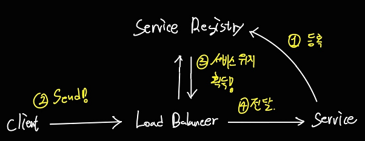

# 서비스 디스커버리란?

MSA 환경에서는 많은 서비스들이 생성되었다가 삭제되고를 반복한다
이때마다 위치 정보(IP)가 바뀔 수 있다

Service를 사용하는 Client는 좀전까지 사용하던 Service의 IP가 바뀜으로 Service를 사용할 수 없게된다.

레거시 방식에서는 서비스 관리자가 Config를 수동으로 바꿔주는 노력이 필요했다.

하지만 MSA에서는 서비스가 정말 많기 때문에 이를 서비스 관리자가 직접 바꾸기에는 불가능에 가깝다.

이를 해결하기 위한 매커니즘이 `Service Discovery`다

---

## 서비스 디스커버리의 기본 매커니즘

기본적으로 `Service Discovery` 아래와 같이 심플한 단계를 거친다

1. 등록 : 서비스의 위치정보를 Service Registry 에 `등록`한다.
2. 검색 : 서비스를 사용해야하는 상황이 오면 서비스가 어디에 있는지 Service Registry에서 `검색`한다.

---

## 서비스 디스커버리의 구현

일반적으로 서비스 디스커버리의 구현은 `두 타입`으로 나뉜다

### Client Side Discovery

1. Service 가 자신의 위치정보를 Service Registry 에 `등록`한다.
2. Client 는 Service Registry에 서비스의 `위치 정보를 요청`한다.
3. Client 가 서비스 위치정보를 가지고 `직접 로드 밸런싱`한다.

#### 장점

- 한번 `위치 정보`를 획득해놓고 `캐싱`하면 캐싱이 유효할때까지 `Service Registry` 를 거쳐갈 필요가 없기 때문에 `네트워크 리소스가 줄어든다`

#### 단점

- Client가 여러개고 각각 다른 언어와 프레임워크로 구성되어있을 경우 `Client 별로 구현이 다르기 때문에 복잡`해진다

### Server Side Discovery

1. Service 가 자신의 위치정보를 Service Registry 에 `등록`한다.
2. Client 는 Load Balancer 에게 보낼 데이트를 전달한다.
3. Load Balancer는 Service Registry 에서 Client가 전달한 메세지가 도달해야하는 Service의 위치정보를 획득한다.
4. Client가 전달한 메세지를 서비스에 전달한다.

#### 장점

- Client는 로드 밸런서 `구현에 대해서 신경쓸 필요가 없기 때문에 로직이 깔끔`하다

#### 단점

- 강제적으로 매번 Load Balancer 쪽으로 메세지를 전달해야하기 때문에 `네트워크 리소스가 증가`한다

---

## 서비스 등록 방식

서비스를 `Service Registry` 에 등록하는 방식이 `두가지`로 나뉜다

### 자가등록 (Self Registration)

서비스 자신이 `직접` 자신의 위치 정보를 Service Registry 에 `등록, 삭제, 하트비트(생존신호)`한다

### 외부 등록 (Third Party Registration)

별도의 `서비스 등록자(Service Register)` 가 서비스 대신 `등록, 삭제, 하트비트(생존신호)`한다

---

## 결론

**서비스 디스커버리는 별도의 `Service Repository` 를 이용하여 서비스의 위치정보에 대한 `등록, 조회, 삭제` 를 지원하여 `Client 들의 편의성을 상승`시켜주는 방식을 말한다**
