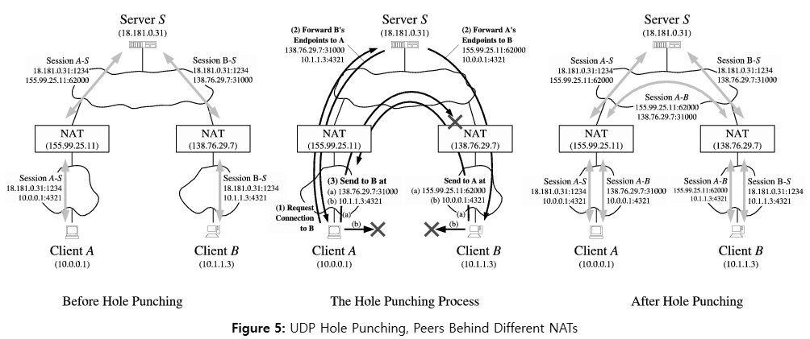

# p2p에서 udp 홀 펀칭(hole punching)

udp 홀 펀칭이란 아웃바운드만 열고 NAT 간에 UDP 통신이 가능하도록 구멍 뚫는것을 말함

## 서로 다른 NAT 뒤에 Client 가 있을 때

  

위 세개의 이미지 중에서 `중간 이미지` 가 좀 어려울 수 있다

`(1) Request Connection to B` 와 `(2) Forward B's Endpoints to A` 이 부분은 그냥저냥 이해가 되는데

`(3) Send to B at` 의 그림이 이해가 잘 안간다

`(a) 138.76.29.7:31000` 이 왜 실패하냐? 

최초 A가 B의 퍼블릭 주소로 보내는 UDP 패킷은 B의 NAT 입장에서 인바운드 패킷이고, B의 NAT는 인바운드는 하나도 열어놓지 않았다.

앞서 B의 NAT는 Server S에게 A의 퍼블릭 주소를 획득하기 위해 보냈던 요청(좌측 이미지 참고)으로 인하여
`아웃바운드`로 `orgin-src:10.1.1.3:4321 / NAT changed-src:138.76.29.7:31000 / dst:18.181.0.31:1234` 이라는 맵핑 정보만 저장해놓았기에

`Server S(18.181.0.31:1234)` 가 `138.76.29.7:31000` 로 요청을 보낼 경우만 패킷이 허용되는 상태이다

A가 B로 보내는 최초 요청 `(a) 138.76.29.7:31000` 이 실패했지만

이로 인하여 앞서 B의 퍼블릭 주소 획득을 위해 Server S와의 맵핑 정보(좌측 이미지 참고)

`orgin-src:10.0.0.1:4321 / NAT changed-src:155.99.25.11:62000 / dst:18.181.0.31:1234` 를

`orgin-src:10.0.0.1:4321 / NAT changed-src:155.99.25.11:62000 / dst:138.76.29.7:31000` 과 같이 `dst`를 B의 NAT으로 바꿔서 저장하게된다

이렇게되면 `B의 NAT(138.76.29.7:31000)` 가 `138.76.29.7:31000` 로 요청을 보낼 수 있는 상태가 된다

이로 인하여 B의 NAT이 들어올 수 있는 `구멍` 이 뚫림

## 참고 링크
https://bford.info/pub/net/p2pnat/

