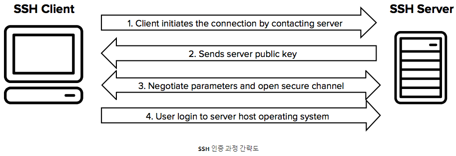

# SSH(Secure Shell Protocol) 란?

  

*SSH**!! 들어도 보았고 사용도 해보았는데 누군가 **"SSH 가 무엇이니?"** 라고 질문 했을때 뚜렷하게 답변할 자신이 없어 공부할 겸 글을 작성해 봅니다.

# SSH ?

우리가 사용하는 서버들은 보통 나와는 멀리 떨어져있는 거리에 있는 것이 대부분입니다.  
  
회사를 다녀보면 보통 서버들은 다른 층, 다른 공간의 서버실이라는 이름하에 옹기종기 모여있거나 또는  
IDC 센터 (internet data center) 더 나아가 아마존의 AWS, 마이크로소프트 Azure 와 같이 클라우드 서버 등 내가 물리적으로 만지기엔 머나먼(?) 곳에 존재합니다.  
  
우리는 이 서버를 통하여 어떠한 작업을 하기 위해서 자동차를 타고 IDC 센터를 가거나, 비행기를 타고 아마존의 서버실에 가지는 않습니다.  
보통은 내가 사용하는 개인 PC에서 원격으로 서버에 연결하여 하고자하는 작업을 진행하지요.  
그 서버가 윈도우 환경의 서버라면 **원격 데스크톱 연결(RDP)** 를 사용할 것입니다.  
하지만 서버의 환경이 **리눅스**이고 **UI가 필요없는 상황**이라면 굳이 통신에 대한 자원을 소모하여 그래픽 인터페이스의 정보를 가져올 필요가 없습니다. 단순히 터미널만 사용할 수 있으면 되지요.  
  
이를 위해서 고안된 프로토콜에는 rlogin, telnet 등이 존재하는데 초기 이 프로토콜들은 신뢰성을 보장하지 못하였습니다.  
이렇기에 **보안성이 강화된 프로토콜**이 필요했고 이때 등장한 것이 **SSH(Secure Shell)** 입니다.

# SSH 가 보안성이 높은 이유

## 암호화된 통신

기존 Telnet으로 개인 PC와 원격지 PC(Server) 과 통신하는 패킷을 열어보면 문자열 내용이 그대로 보입니다.  
예를들어 개인 PC에서 ls -al 이라는 명령어를 실행시킬때 누군가 이 패킷을 중간에 가로채 열어본다면 개인 PC에서 ls -al 이라는 명령어를 사용했다는 걸 알 수 있죠. 이것이 만약 개인정보 또는 패스워드, 시스템의 중요한 내용 등이라면 심각한 상황에 놓일 수 있습니다.  
반면 우리의 SSH는 이 패킷 정보가 암호화되있어 중간에 가로챈 사람은 ls -al 라는 텍스트가 보이지 않고 읽을 수 없는 의미 불명의 **암호화된 값**만 보이게 됩니다.  
  

  

### Public Key,Private Key

이러한 암호화된 데이터를 전송하기 위해서 **SSH**는 **Public Key**와 **Private Key**라는 것을 사용하는데.  
클라이언트가 될 PC에서 **한쌍**이 되는 **Public Key**와 **Private Key** 를 생성한 후 **Public Key**를 서버와 공유하게 됩니다.  
그 이후 일련의 과정을 통하여 **Public Key**와 **Private Key**를 이용한 **인증된 암호화 채널**을 개설하게 됩니다.  
  

  

  
  
이렇게 보안성이 강화된 SSH로 인하여 오늘날 클라이언트와 서버간에 안전한 원격 터미널 작업이 가능하게 되었습니다.  
다음에는 리눅스 서버를 활용하여 SSH 를 직접 사용해보는 글을 작성해보겠습니다.  
  
감사합니다.  
  
