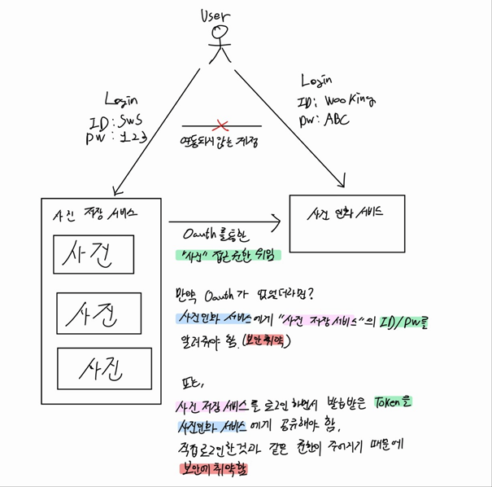
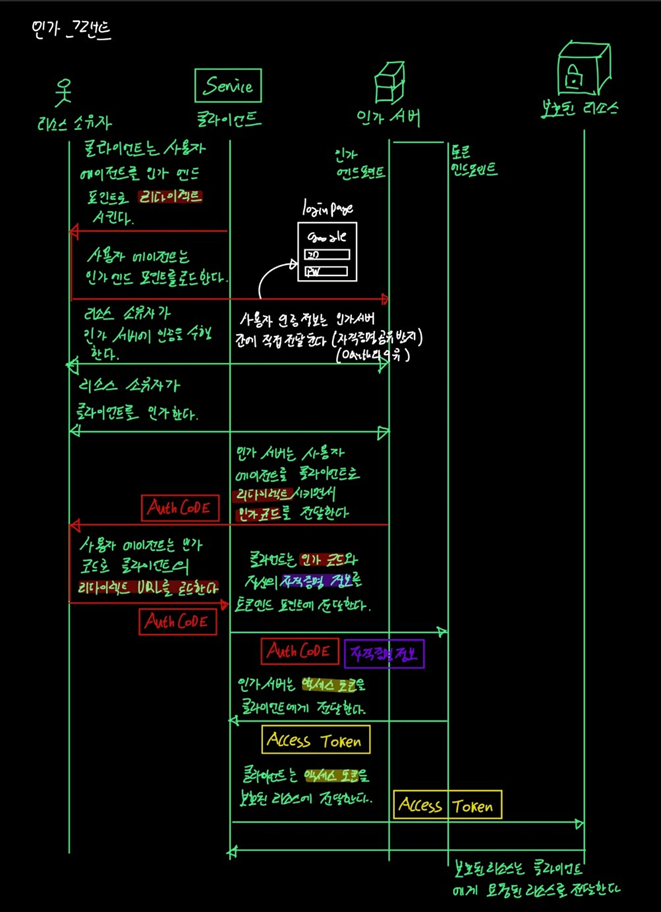

# oauth?

- oauth는 **권한 위임 프로토콜**이다
- oauth는 **비밀번호 공유 패턴을 대체한다**
- oauth는 **토큰을 어떻게 획득하고 그것을 어떻게 사용하는지에 대한 스펙이다**

## 현실에서의 oauth는?

현실에서 oauth를 찾아보자면 자동차 `발렛키` 가 있다.

발렛키는 **발렛 파킹** 을 위한 전용 키로 일반적인 자동차 키보다는 기능이 제한적이다.

|일반 자동차 키 기능| 발렛 키 기능|
|---|---|
|시동 걸기|시동 걸기|
|문 열기|문 열기|
|트렁크 열기||
|글로브 박스 열기||

일반 자동차 키에 비해서 발렛 키는 `트렁크 열기`, `글로브 박스 열기` 두 기능이 제한되며, **주차하는 사람이 개인 물품 공간의 열람 권한이 있으면 물품 분실**등으로 이뤄질 수 있기 때문에 이에 대한 제한이 존재한다.

위와 같이 발렛 파킹에 **필요한 기능만을 `권한 위임`** 하는 것이 oauth이다

---

## oauth가 없을때는 어떻게 서비스간에 권한을 부여했나?

`홍길동` 이라는 사용자가 `사진 저장 서비스`과 `사진 인화 서비스` 두 서비스를 사용한다고 가정하자

각각의 서비스는 별도의 인증이 존재하여 사용자는 두개의 인증 정보를 지니고 있다.

|사진 저장 서비스 ID|사진 저장 서비스 PW|사진 인화 서비스 ID|사진 인화 서비스 PW|
|---|---|---|---|
|king-gil-dong|dildong123!@#|dongdong2|dongdong!23|

자 이제 사용자가 `사진 인화 서비스`를 이용하여 사진을 인화하려고 하는데, 사진들은 `사진 저장 서비스`가 **사진 저장소**에 보관하고 있다

결국 사진 인화를 위해서는 **사진 저장소**에 접근해서 인화할 사진들을 가져와야하는데 `사진 인화 서비스`는 **사진 저장소**에 접근할 수 있는 **권한이 없다**

이때 oauth 가 없을 경우에는 어떤 방식이 있을까?

### ID/PW 공유 방법

단순무식 방법으로 사진 저장 서비스의 `ID/PW를 공유`하는거다

사진 인화 서비스가 **사진 저장소**에 접근시 공유된 `ID/PW`를 이용하여 그냥 로그인을 해버리면된다.

정말 간단해 보이지만 큰 문제가 발생한다

- 월권이 가능해짐 즉, 사진 삭제 등의 인화와는 관련없는 권한이 부여됨
- 동일한 ID/PW를 사용자가 공통으로 쓰고 있을 경우 다른 서비스에서도 로그인 할 수 있음

### 토큰 공유 방법

다른 방법은 `사진 저장 서비스`가 로그인을 하고나서 발급받은 **인증 토큰** 을 공유하는 방법이다.

이 방법은 **동일한 ID/PW를 사용자가 공통으로 쓰고 있을 경우 다른 서비스에서도 로그인 할 수 있음** 라는 문제점이 해결되지만 여전히 문제점이 남아있다.

- 월권이 가능해짐 즉, 사진 삭제 등의 인화와는 관련없는 권한이 부여됨

### 최고의 선택은 OAuth 를 이용한 권한 위임 방법

위 방법들의 문제점을 해결하기 위해서 결국 **OAuth** 가 필요하다.

**사진 인화**를 위한 **일부 권한**만을 `사진 인화 서비스`에게 `위임`하는 것이다.

그러면 `ID/PW 공유`,`토큰 공유` 방식에서 발생하는 문제점들을 해결할 수 있다.

  

---

## 일반적인 OAuth 그랜트 과정

oauth의 일반적인 인가 그랜트(승인) 과정 알아보자

여기서는 몇몇 등장인물(?)들이 존재하는데 oauth 공통이니 알아두자

### oauth 패턴에서의 등장인물들

- **리소스 소유자** : `엔드포인트 유저`를 의미한다, 컴퓨터,핸드폰을 사용하는 우리들이라고 보면 된다
- **보호된 리소스** : 리소스 소유자의 `리소스들이 저장된 공간`이다. 예를 들어 `사진`,`개인정보` 등이 저장된 `구글 드라이브` 라고 볼 수 있다
- **인가 서버** : 보호된 리소스에 `접근할 수 있는 권한을 부여해주는 서버`이다. 예를 들어 `구글 인증 서비스` 라고 보면 된다
    1. **인가 엔드 포인트** : 리소스 소유자의 인증 정보를 받아서 `인가` 해주는 엔드 포인트이다. 예를 들어 사용자로부터 ID/PW 를 받아 리소스 소유자임을 확인해주는 엔드 포인트다
    2. **토큰 엔드 포인트** : `인가된 정보` + `클라이언트의 자격증명` 으로 부터 보호된 리소스에 접근할 수 있는 `토큰을 발급, 검증` 해주는 엔드 포인트다.
- **클라이언트** : `보호된 리소스` 에 접근하려는 외부 서비스라고 보면 된다, 예를 들어 `내가 개발한 서비스`가 있고 이 서비스가 `구글 인증`을 이용한다고 할 때 `내가 개발한 서비스가 클라이언트`다

  
