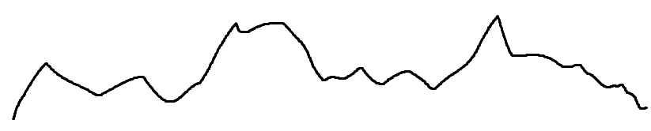

import { Callout } from 'nextra/components'

# Flux의 flatMap()과 map()의 차이점

## 일단 요약

flatMap은
- `다른 형식의 다수의(옵션) Flux로 변환(생성)하고, 그 Flux를 하나의 Flux로 만든다(평탄화)`
- flatMap() 을 통한 요소 순회는 **비동기**, 그에 따라 **반환값도 일정하지 않을 수 있음을 항상 주의**
- 예시 코드
```java
Flux<Integer> originalFlux = Flux.just(1, 2, 3);

Flux<String> flatMappedFlux = originalFlux.flatMap(num ->
        Flux.just("A" + num, "B" + num)
);

// flatMappedFlux: A1, B1, A2, B2, A3, B3
```

## flat

**flat = 평평한**

불규칙하게 높고 낮은 상태를 평평한 상태로 만드는 작업을 평탄화라고 합니다.

우리가 "A4" 용지를 손에 들고 마구 구긴 다음 살짝만 펴서 책상에 놓고, 책상과 평행하게 바라보면

  

이런식으로 불규칙한 높낮이를 보일겁니다.

이를 **평탄화** 하기 위해서는 우리는 어떤 방법을 사용할까요?

별도의 도구가 없을 경우 그냥 손으로 쭉쭉 눌러서 피게될겁니다.

최대한 열심히 쭉쭉 누르면 처음과 똑같진 않지는 어느정도 평평해집니다.

자 그럼 종이를 `Flux`에 비유하겠습니다.

아래와 같이 요소가 제각각인 여러개의 Flux가 존재한다고 칩니다.

마치 높낮이가 다른 종이의 주름진 부분들 같아 보이죠

```java
Flux.Just("a", "b")

Flux.Just("a", "b", "c", "d")

Flux.Just("a")

Flux.Just("a", "b", "c")

Flux.Just("a", "b", "c", "d", "e")

Flux.Just("a")
```

자 그럼 이 Flux 들을 평탄화하기 위해 **쭉쭉 눌러서** 펴보겠습니다.

```java
Flux.Just("a", "b", "a", "b", "c", "d", "a", "a", "b", "c", "a", "b", "c", "d", "e", "a")
```

아주 이상적으로 펴졌죠?

이렇게 **각각 다른 여려개의 Flux를 하나의 Flux로 평탄화** 하는 것을 `flat`

라고합니다.

그럼 여기에 **map**을 더한 **flatMap**은 무엇일까요?

## map

map은 **mapping = 어떤 값을 다른 값에 대응시키는 것** 을 의미하는데

`1 -> "A"` 와 같이 **숫자 1을 "A"** 라는 전혀 다른 형식의 문자로 대응시키는 것과 같이
**다른 형태로 변환** 하는 의미를 갖습니다.

java의 문법중 stream 의 map() 함수를 사용하신 분들은 빠르게 이해하실 수 있으실 겁니다

예를 들어보겠습니다

```java
// 1부터 10까지의 숫자 스트림을 생성합니다.
IntStream stream = IntStream.range(1, 11);

// map()을 사용하여 각 숫자를 문자열로 변환합니다.
Stream<String> mappedStream = stream.map(n -> (char) ('A' + n - 1));

// mappedStream을 출력합니다.
mappedStream.forEach(System.out::println);
```

```java
// 출력 결과
ABCDEFGHIJ
```

위 예시에서 **숫자 1~11 까지를 ABC~~ 와 같이 문자라는 전혀 다른 형식으로 변환했습니다.**

이렇게 **원본 값을 전혀 다른 무엇으로 변경하는 것이 보통의 map() 기능입니다**

그렇다면 둘을 합친  `flat + map = flatMap` 은 뭘까요

## flatMap

`flatMap = 변환한 다음 평탄화한다`

이것을 Flux에서는 `다른 형식의 다수의(옵션) Flux로 변환(생성)하고, 그 Flux를 하나의 Flux로 만든다(평탄화)` 라는 의미입니다

아직은 아리쏭 합니다.

예를 들어보겠습니다.

```java

Flux<Integer> originalFlux = Flux.just(1, 2, 3);

Flux<String> flatMappedFlux = originalFlux.flatMap(num ->
        Flux.just("A" + num, "B" + num)
);

// flatMappedFlux: A1, B1, A2, B2, A3, B3
```

예시에서 `1, 2, 3` 이라는 요소를 가진 하나의 `Flux<Integer> originalFlux` 를 가지고  `flatMap()` 내부에서 `Flux.just("A" + num, "B" + num)` 을 통해
A와 B가 붙은 **새로운 Flux**를 생성합니다.

이렇게 생성된 Flux는 기존과 달리 `Flux<String>` 형식으로 생성되는데, flatMap() 내부에서 총 3개의 신규 `Flux<String>` 가 생성됩니다.

생성된거는 `3개의 Flux<String>` 지만 결과 값을 담는 변수는  `Flux<String> flatMappedFlux` 로 하나의 Flux 객체에 담게됩니다.

즉, `3개의 Flux<String>` 가 `1개의 Flux<String>` 로 **평탄화** 되어진 상황이죠

`다른 형식의 다수의(옵션) Flux로 변환(생성)하고, 그 Flux를 하나의 Flux로 만든다(평탄화)` 가 성립되는 모습입니다.

좀 더 풀어서 말하면

<Callout type="info" emoji="👨‍💻">
  **`한개의 Flux를 flatMap() 을 통하여 요소를 순회하며 여러개의 Flux를 생성한 후 결과값으로 하나의 Flux로 반환한다`** 입니다
</Callout>


추가적인 내용으로 flatMap() 에는 map() 과는 다른 특징이 있습니다.

## 특징

flatMap() 을 통한 요소 순회는 **비동기** 입니다.

`Flux.just(1, 2, 3)` 이 존재할 때

`1 -> 2 -> 3` 으로 순서대로 실행되지 않고

`2 -> 1 -> 3` 으로 실행될 수도 있고,

`3 -> 한참 시간이 흐른 후 -> 1 -> 2` 과 같이 실행될 수도 있습니다.

그에 따라 **반환값도 일정하지 않을 수 있으니 이를 항상 주의해야합니다.**

| 특징 | flatMap | Map |
|---|---|---|
| 입력 Flux 객체에서 생성되는 출력 Flux 객체의 개수 | **여러 개** | **하나** |
| 출력 Flux 객체의 이벤트 수가 입력 Flux 객체의 이벤트 수와 일치하는지 여부 | **일치하지 않을 수 있음** | **일치함** |
| 출력 Flux 객체의 이벤트가 입력 Flux 객체의 이벤트 순서를 유지하는지 여부 | **유지하지 않을 수 있음** | **유지함** |