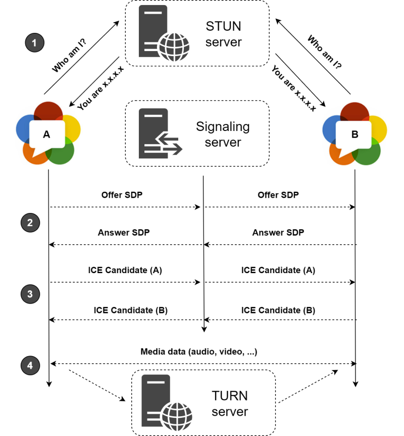

import { Callout } from "nextra/components";

# webRTC 기본 개념

webRTC 를 이용한 프로젝트를 진행하게될 일이 생겼다. 기본 개념을 알고 시작하자

## 구성도


이미지 출처: https://medium.com/monday-9-pm/%EC%B4%88%EB%B3%B4-%EA%B0%9C%EB%B0%9C%EC%9E%90-webrtc-%EC%8B%9C%EB%8F%99%EA%B1%B8%EA%B8%B0-ebefe6feadf7

## WebRTC 지원 서버

아래는 WebRTC 통신에 필요한 필수, 옵션 서버들이다

<Callout type="info" emoji="ℹ️">
    **NAT(Network Address Translation) 이란?**
    공인 IP 를 내부 IP로,
    내부 IP를 공인 IP로 변환해주는 작업
    보통 `라우터`가 해준다

    예시

    출발지 IP (내부) : 192.168.0.100

    공인 IP : 198.51.100.1

    도착지 IP : 203.0.113.1

    NAT을 거치면 출발지 IP가 **198.51.100.1** 로 변경됨

</Callout>

### STUN 서버 (Session Traversal Utilities for NAT, NAT 통과 유틸리티 서버)

클라이언트(피어) 가 자신의 공인 IP 정보를 요청하고 획득할 수 있게 해주는 서버다
클라이언트가 요청을 보내면 외부 인원이 나와 통신(P2P)할 수 있는 공인 IP 정보를 응답한다.

필수 여부 : 필수

### TURN 서버 (Traversal Using Relays around NAT, NAT 우회 릴레이 서버)

방화벽 설정으로 Peer간의 다이렉트 통신이 불가능할 수 있다(대부분의 경우 불가능하다), 그러면 방화벽 범위 밖에서 데이터를 받아서 전달하는 릴레이 작업이 필요한데
그것을 해주는 것이 TURN 서버이다
Peer A가 Peer B에게 send 하면, 그것을 TURN 서버가 받아서 Peer B에게 전달한다.

필수 여부 : 옵션이나 사실상 대부분 필수

### 시그널링 서버 (Signaling Server, 신호 교환 서버)

Peer 간 연결 설정 정보를 교환하여 `SDP`와 `ICE` 후보 정보를 주고 받습니다

필수 여부 : 필수

#### SDP(Session Description Protocol, 세션 설명 프로토콜)란?

##### 정의

SDP는 세션의 매개변수를 기술하는 포맷이다. 이는 주로 멀티미디어 통신 세션을 설정, 변경, 종료하는 데 사용된다.

##### 역할

SDP는 피어 간에 미디어 세션을 설정하기 위해 필요한 정보를 교환한다. 여기에는 다음과 같은 정보가 포함된다.

- **미디어 타입 (오디오, 비디오 등)**
- **코덱 (예: PCMU, H.264 등)**
- **네트워크 정보 (IP 주소, 포트 등)**
- **세션의 기타 속성 (예: 암호화 정보 등)**

##### 구조

SDP 메시지는 텍스트 형식으로 작성되며, 여러 줄로 구성된다. 각 줄은 특정 정보를 나타내는 필드로 시작한다.

`v=:` 버전

`o=:` 세션의 오너/생성자와 세션 ID

`s=:` 세션 이름

`c=:` 연결 정보 (네트워크 타입, IP 주소)

`t=:` 시간 정보

`m=:` 미디어 정보 (미디어 타입, 포트, 전송 프로토콜, 포맷 리스트)

`a=:` 미디어 속성 (예: 코덱, rtpmap 등)

##### 예시

```text
v=0
o=- 46117341 2 IN IP4 127.0.0.1
s=Session SDP Example
t=0 0
m=audio 49170 RTP/AVP 0
a=rtpmap:0 PCMU/8000
```

이 예시는 다음을 나타낸다

- `v=0`: SDP 버전 0
- `o=- 46117341 2 IN IP4 127.0.0.1`: 생성자 정보
- `s=Session SDP Example`: 세션 이름
- `t=0 0`: 세션 활성화 시간 (0 0은 항상 활성화)
- `m=audio 49170 RTP/AVP 0`: 오디오 스트림이 포트 49170에서 RTP/AVP 프로토콜로 전송되며, 포맷 0 (PCMU)을 사용
- `a=rtpmap:0 PCMU/8000`: 포맷 0은 PCMU 코덱을 사용하며, 샘플링 속도는 8000Hz

#### ICE(Interactive Connectivity Establishment, 상호 연결 설정)란?

##### 정의

ICE는 NAT(Network Address Translation) 및 방화벽을 통과하여 두 피어 간의 연결을 설정하는 메커니즘이다.

##### 역할

ICE는 피어 간의 연결 설정을 돕기 위해 여러 네트워크 주소 후보를 수집하고 테스트한다. 이를 통해 최적의 연결 경로를 찾는다.

##### 과정

**1. 후보 수집 (Candidate Gathering)**

각 피어는 가능한 모든 네트워크 주소 후보를 수집한다. 여기에는 로컬 IP 주소, 공인 IP 주소 (STUN 서버를 통해 획득), 릴레이 주소 (TURN 서버를 통해 획득)가 포함된다.

**2. 후보 교환 (Candidate Exchange)**

피어들은 시그널링 서버를 통해 서로의 후보를 교환한다.

**3. 연결성 검사 (Connectivity Checks)**

교환된 후보들을 사용하여 각 피어는 서로 연결을 시도한다. 이는 STUN을 통해 수행되며, 각 후보 쌍에 대해 연결 가능성을 테스트한다.

**4. 최적 경로 선택 (Candidate Pair Selection)**

연결성 검사 결과에 따라 최적의 경로가 선택된다. 이는 연결 안정성, 대기 시간 등을 고려하여 결정된다.

##### 예시

피어 A와 피어 B가 각자 로컬 IP, 공인 IP (STUN), 릴레이 IP (TURN)를 수집한다.
피어 A는 자신의 후보들을 시그널링 서버를 통해 피어 B에게 보낸다. 피어 B도 자신의 후보들을 피어 A에게 보낸다.
각 피어는 받은 후보들로 연결을 시도하고, 가장 좋은 연결 경로를 선택한다.

## SRTP vs SCTP

### SRTP (Secure Real-time Transport Protocol)

UDP 기반

비디오나 오디오의 실시간 전송에 사용

### SCTP (Stream Control Transmission Protocol)

별도의 프로토콜

UDP + TCP 인 별도의 프로토콜, 신뢰성 보장하기 때문에 손실이 발생하면 안되는 파일 데이터 전송등에 사용함

- UDP 특징 : 메시지 단위 전송
- TCP 특징 : 순서 보장

## 참고 링크

https://lovejaco.github.io/posts/webrtc-connectivity-and-nat-traversal/
https://www.netmanias.com/ko/post/blog/6263/nat-network-protocol-p2p/p2p-nat-nat-traversal-technic-rfc-5128-part-2-udp-hole-punching
https://bford.info/pub/net/p2pnat/
https://webrtc.org/getting-started/peer-connections-advanced?hl=ko
