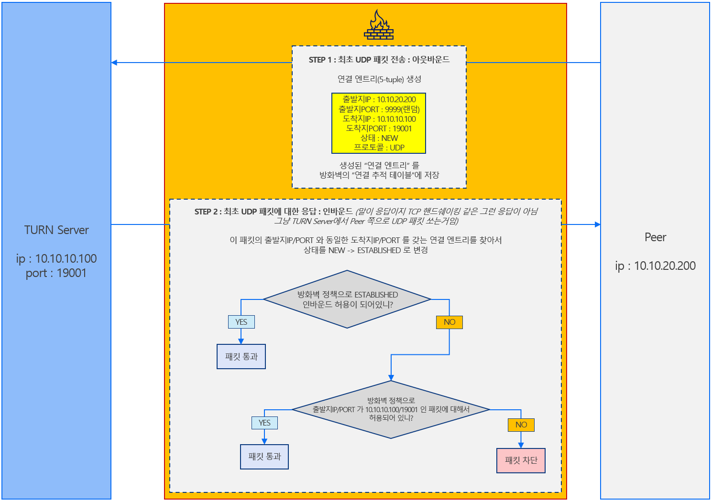

# webRTC TURN 서버 사용 시 방화벽 인/아웃바운드 정책 설명

  

## 결론

### 방화벽 정책으로 인바운드 ESTABLISHED `허용` 되어있으면

도착지가 TURN Server IP/PORT 인 UDP 아웃바운드 허용하면 문제없음

**아웃바운드 설정 예시**

```text
프로토콜 : UDP
도착지 IP : <TURN Server IP>
도착지 PORT : <TURN Server Service PORT>
```

### 방화벽 정책으로 인바운드 ESTABLISHED `비허용` 되어있으면

도착지가 TURN Server IP/PORT 인 UDP 아웃바운드 허용하면 통신 안됨
출발지가 TURN Server IP/PORT 인 인바운드 별도로 허용해야함

**인바운드 설정 예시**

```text
프로토콜 : UDP
출발지 IP : <TURN Server IP>
출발지 PORT : <TURN Server Service PORT>
```